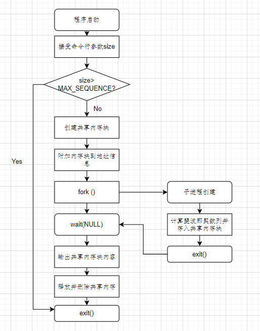

# 《操作系统实验报告》——实验二

***姓名：Matthew	学号：	报告日期：2023.4.23***

## 实验内容

在习题3.6中，由于父进程和子进程都有它们自己的数据副本，子进程必须输出Fibonacci序列。设计此程序的另一个方法是在父进程和子进程之间建立一个共享内存段。此方法允许子进程将Fibonacci 序列的内容写入共享内存段，当子进程完成时，父进程输出此序列。由于内存是共享的，每个子进程的变化都会影响到共享内存,也会影响到父进程。

这个程序将采用3.5.1小节介绍的 POSIX 共享内存方法来构建。程序首先需要创建共享内存段的数据结构，这可以通过利用struct 来完成。此数据结构包括两项:(1)长度为MAX_SEQUENCE 的固定长度数组，它保存Fibonacci 的值:(2)子进程生成的序列的大小——Sequence_Size，其中 sequence_size<=MAX_SEOUENCE。这些项可表示成如下形式:

```c++
#define MAX_SEQUENCE 10
typedef struct {
	long fib_sequence [MAX_SEQUENCE];
	int sequence_size;
} shared data;
```

父进程将会按下列步骤进行:

a. 接受命令行上传递的参数，执行错误检查以保证参数不大于MAX_SEQUENCE

b. 创建一个大小为shared_data的共享内存段。

c. 将共享内存段附加到地址空间。

d. 在命令行将命令行参数值赋予shared_data。

e. 创建子进程,调用系统调用 wait()等待子进程结束。

f. 输出共享内存段中 Fibonacci序列的值。

g. 释放并删除共享内存段。

由于子进程是父进程的一个副本，共享内存区域也将被附加到子进程的地址空间。然后，子进程将会把Fibonacci序列写入共享内存并在最后释放此区域。

采用协作进程的一个问题涉及同步问题。在这个练习中，父进程和子进程必须是同步的，以使在子进程完成生成序列之前，父进程不会输出 Fibonacci序列。采用系统调用wait()，这两个进程将会同步。父进程将调用 wait(,这将使其被挂起,直到子进程退出。

## 实验目的

+ 通过实验，了解在Linux中如何创建子进程，以及父子进程之间的关系；
+ 通过实验，学习如何创建、使用和删除共享内存段；
+ 通过实验，加深对进程和共享内存的理解。

## 设计思路和流程图

**父进程**：

1.接受命令行上传递的参数，执行错误检查以保证参数不大于MAX_SEQUENCE。

2.创建一个大小为shared_data的共享内存段。

3.将共享内存段附加到地址空间。

4.在命令行将命令行参数值赋予shared_data。

5.创建子进程，调用系统调用wait(NULL)等待子进程结束。

6.输出共享内存段中 Fibonacci序列的值。

7.释放并删除共享内存段。

**子进程**：

计算Fibonacci序列的值存在共享内存段中



## 主要数据结构及其说明

1）长度为MAX_S 的固定长度数组，它保存 Fibonacci的值;

(2）子进程生成的序列的大小sequence_size，其中 sequence_size≤MAX_S。


## 源程序与注释

```c++
#include <iostream>
#include<stdio.h>
#include<sys/shm.h>
#include<sys/stat.h>
#include<sys/wait.h>
#include <unistd.h>

using namespace std;
#define MAX_S 10

struct shared_Data{
    long fib_sequence[MAX_S]; //保存斐波那契数列的值
    int sequence_size; //子进程生成的序列的大小
};

int main() {
    shared_Data sharedData;
    int sizeOfShared;
    int segment_id;
    // 命令行输入并检查
    cout<<"input the size " <<endl;
    cin>>sizeOfShared;
    if(sizeOfShared>MAX_S)
        return -1;
    const int size = sizeof(shared_Data);
    // 创建共享空间
    segment_id = shmget(IPC_PRIVATE,size,S_IRUSR|S_IWUSR);
    // 添加至地址空间
    shared_Data* sharedMemory = (shared_Data*)shmat(segment_id,NULL,0);
    sharedMemory->sequence_size=sizeOfShared;
    sharedMemory->fib_sequence[0]=0;
    sharedMemory->fib_sequence[1]=1;
    pid_t pid;
    // 创建子进程
    pid = fork();
    if(pid<0)
    {
        exit(-1);
    }
    else if(pid==0)
    {
        for(int i=2;i<sharedMemory->sequence_size;++i)
            sharedMemory->fib_sequence[i] = sharedMemory->fib_sequence[i-1]
                    + sharedMemory->fib_sequence[i-2];
        exit(0);
    }
    else{
        wait(NULL); // 等待子进程结束
        for(int i=0;i<sharedMemory->sequence_size;++i)
            cout<<sharedMemory->fib_sequence[i]<<" ";
    }
    // 释放并删除共享字段
    shmdt(sharedMemory);
    shmctl(segment_id, IPC_RMID, NULL);
    return 0;
}
```

## 程序运行初值与运行结果


**输入：**sequence_size

**运行结果：**输出长度为sequencesize的Fibonacci序列

## 实验体会

1. 通过实验加深了对共享内存的理解，了解了其实现机制以及使用方式。

2. 在申请共享内存段时要注意指针的指向以及通过segment_id进行确定共享内存段位置，才可以在进程中正确找到共享内存段位置进行操作。

   
