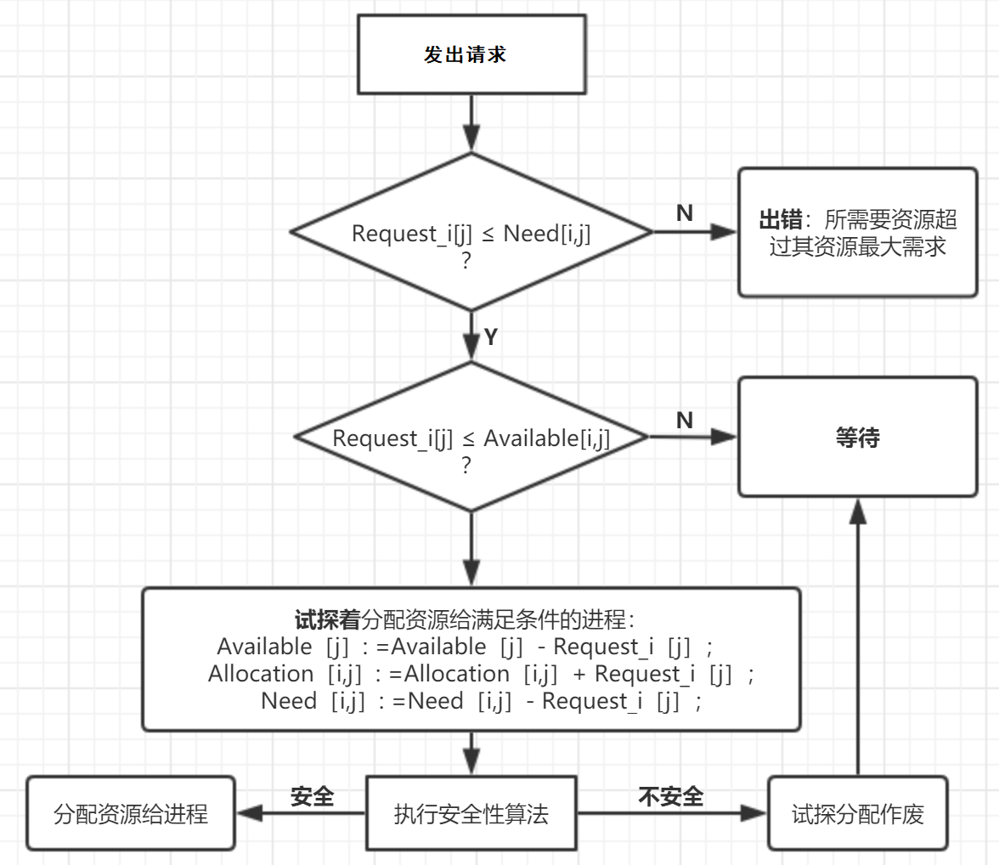
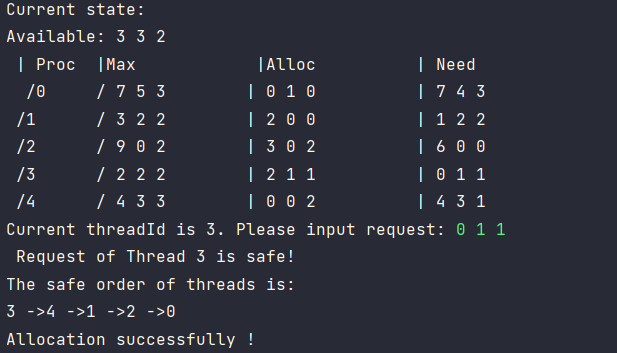
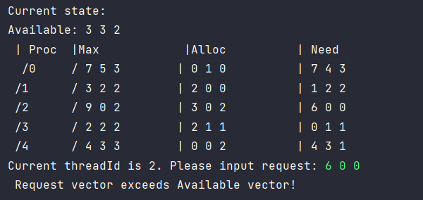

# 《操作系统实验报告》——实验二

***姓名：Matthew	学号：	报告日期：2023.4.23***

## 实验内容

编写一个多线程程序，实现7.5.3小节所描述的银行家算法。创建n个线程来向银行申请或释放资源。只有保证系统安全，银行家才会批准请求。可以用Pthread或Win32线程来编程。注意共享数据的并发访问要安全。可以通过互斥锁（Pthread或Win32 API中都有）来保证访问安全。

## 实验目的

+ 通过实验，实现银行家算法，进一步加深对银行家算法的理解于应用；
+ 通过实验，加深对共享内存临界区问题的理解；
+ 通过实验，学会Linux下多线程程序（模拟多进程）中临界区问题的互斥访问；
+ 通过实验，加深对死锁、安全状态等的理解。

## 设计思路和流程图

### 设计思路：

+ 确定全局共享变量（包括互斥锁mutex）

+ 编写安全性算法

+ 编写资源请求算法

+ 设计编写线程入口函数，执行资源申请请求

+ 主进程创建N个线程开始执行资源申请请求：随机抽取一个进程由用户输入资源请求向量，代码编写过程中要注意临界区的互斥访问以及避免死锁的问题。



## 主要数据结构及其说明

+ `pthread_mutex_t mutex` 互斥锁

+ `int Available[M]` 可提供资源矩阵
+ `int Max[N][M]` 最大需求矩阵
+ `int Allocation[N][M]` 分配矩阵
+ `int Request[N][M]` 申请资源矩阵
+ `int Need [N][M]` 需求资源矩阵
+ `int Work[M] int Finish[N]`

## 源程序与注释

```c++
#include <pthread.h>
#include <stdlib.h>
#include <stdio.h>
#include <time.h>
#include <unistd.h>
#define N 5//线程数
#define M 3//资源种类数
#define false 0
#define true 1

pthread_mutex_t mutex ;

int Available[M]={3,3,2};

int Max[N][M]={
        {7,5,3},
        {3,2,2},
        {9,0,2},
        {2,2,2},
        {4,3,3}
};

int Allocation[N][M]={
        {0,1,0},
        {2,0,0},
        {3,0,2},
        {2,1,1},
        {0,0,2}
};

int Need [N][M];

//进程申请资源矩阵
int Request[N][M];

//标记发出请求的线程号(0-9)，-1为初始值
int requestThreadId;

int Work[M];
int Finish[N] ;
//初始化
void init(){
    requestThreadId=-1;
    pthread_mutex_init(&mutex,NULL);//初始化mutex互斥锁int i, j;
    for ( int i=0; i<N; i++)
        for (int j=0; j<M ; j++)
            Need [i][j]=Max[i][j]-Allocation [i][j];
}
//展示数据
void ShowData(){
    int i, j;
    printf ( "Current state: \n" );
    printf ( "Available: " );
    for(j=0; j<M; j++)
        printf ( "%d " , Available[j] );
    printf ( "\n | Proc\t |Max\t\t |Alloc\t\t | Need\n " );

    for(i=0; i<N ; i++){
        printf(" /%d\t / ",i);

        for(j=0; j<M; j++)
            printf ( "%d " ,Max [i][j]);

        printf( "\t| " );

        for( j=0; j<M; j++)
            printf ( "%d " ,Allocation[ i][j]);

        printf ( "\t | " );

        for(j=0; j<M ; j++)
            printf ( "%d " , Need [ i][j]);

        printf ( "\n" );
    }
}

//判断现有资源是否该线程完成:Need[i]<W
int isThreadComplete(int i){
    for(int j=0; j<M ; j++){
        if(Work[j]<Need[i][j])
            return 0;
    }
    return 1;
}

//释放该线程的资源
void Release(int i){
    for(int j=0; j<M; j++) {
        Work[j] += Allocation[i][j];
    }
}

//判断请求是是否合理:Request[i]<Need[i]
int isRequestValid(int threadId)
{
    for(int j=0; j<M; j++)
        if (Request[threadId][j]>Need [threadId][j])
            return false;
    return true;
}
//判断现有资源是否足够分配:Available>=Request[i]
int isEnough(int threadId)
{
    for(int j=0; j<M; j++)
        if(Available[j]<Request[threadId][j])
            return false;
    return true;
}

//安全算法
int checkSafety(int threadId){
    int i,j,k;
    for(i=0; i<M; i++)
        Work[i]=Available[i];
    for(j=0; j<N ;j++)
        Finish[j]=0;
    int Security[N];//记录线程的安全序列
    int cnt = 0;//记录可以完成的线程数量
    for (k=0;k<N; k++)
    {
        for (i=0 ; i<N ; i++)
        {
            if (Finish[i]==0){
                if (isThreadComplete(i)==1){
                    Security[cnt++]=i;//记录可以完成的线程号i，并让计数器cnt++
                    Finish[i]=true;//该进程完成置为true
                    Release(i);//释放该进程的资源
                }
            }
        }
        if (cnt==N)//全部进程都可以结束，提前跳出循环
            break;
    }

    //判断所有线程都可以完成
    if (cnt!=N)
        return 0;

    //打印安全序列
    printf ( "Request of Thread %d is safe! \nThe safe order of threads is: \n" , threadId);
    for( i=0 ; i<N ; i++){
        printf ( "%d " , Security[i]);
        if( i!=N-1)
            printf( "->");
    }
    printf( "\n" );
    return true;
}

int RequestSource(int threadId){
    int j;

    //判断是否超过最大所需
    if ( !isRequestValid(threadId)){
        printf ( "Request vector exceeds Need vector ! \n\n" );
        return -1;
    }

    //判断需求是否能够满足
    if (!isEnough(threadId)){
        printf ( "Request vector exceeds Available vector! \n\n" );
        return -2;
    }
    for(j=0; j<M; j++)//将资源分配给该线程
    {
        Available[j]-=Request[threadId][j];
        Allocation[threadId][j]+=Request[threadId][j];
        Need[threadId][j]-=Request[threadId][j];
    }

    //不安全则恢复为原来的资源分配状态
    if ( !checkSafety(threadId))
    {
        for(j=0; j<M; j++)
        {
            Available[j]+=Request[threadId][j];
            Allocation [threadId][j]-=Request[threadId][j];
            Need [threadId][j]+=Request[threadId][j];
        }
        printf ("Request of Thread %d will cause the system to be int an unsafe state!\n\n" , threadId);
        return -3;
    }
    //成功分配
    printf ( "Allocation successfully ! \n\n" );
    return 1;
}

//线程入口函数
[[noreturn]] void* thread (void *arg)
{
    int threadId= *(int*)arg;
    while(true)
    {
        //临界区
        sleep(1);
        pthread_mutex_lock(&mutex);
        if ( requestThreadId==threadId)
        {
            RequestSource(threadId);
            requestThreadId=-1;
        }
        pthread_mutex_unlock (&mutex) ;
    }
}

int main()
{
    int i,j;
    srand(time(0));
    init();
    pthread_t threadId[N];
    int ids[] = {0,1,2,3,4};
    int ret[5];
    ret[0] = pthread_create( &threadId[0],NULL,thread,&ids[0]);
    ret[1] = pthread_create( &threadId[1],NULL,thread,&ids[1]);
    ret[2] = pthread_create( &threadId[2],NULL,thread,&ids[2]);
    ret[3] = pthread_create( &threadId[3],NULL,thread,&ids[3]);
    ret[4] = pthread_create( &threadId[4],NULL,thread,&ids[4]);

    for(i=0;i<N;i++)
        if(ret[i]!=0)
            printf("Create thread error!\n");

    for (i=0; i<N ; i++)
    {
        sleep(1);
        //临界区
        pthread_mutex_lock(&mutex);
        ShowData( );
        requestThreadId = rand()%N;
        printf("Current threadId is %d. Please input request: ",requestThreadId);
        for (j=0 ; j<M;j++)
            scanf("%d" ,&Request[requestThreadId][j]);
        pthread_mutex_unlock(&mutex);
    }
    printf ( "The main thread ends . \n" );
    return 0;

}
```

## 程序运行初值与运行结果

可以成功分配案例：



分配失败案例：



## 实验体会

在编写多线程并且由临界区问题的时候需要非常注意锁的使用，否则容易导致死锁与临界区的非互斥访问。

+ 实验中一开始时候在访问临界区之前调用了`pthread_mutex_lock()` 由于在临界区域中的调用函数的实现中再调用了一次，导致了死锁；

+ 在主进程修改`requestThreadId`和`Request[requestThreadId]`（选择申请资源的进程号）的时候忘记上锁，导致在函数`thread()`中提前访问`Request[requestThreadId]`导致了临界区的非互斥访问。

