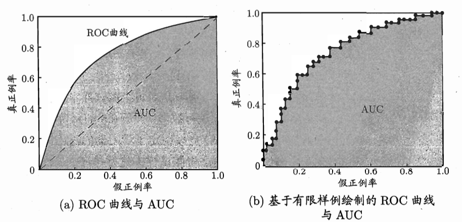
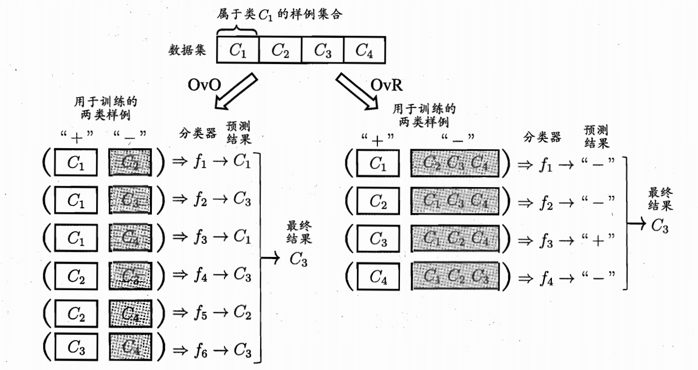
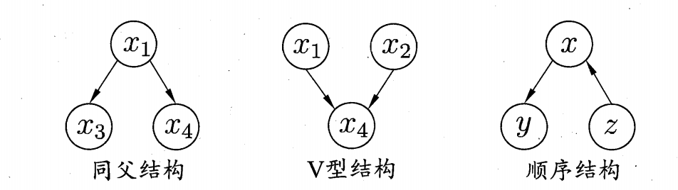

<center ><h1>
 机器学习复习笔记（西瓜书）
</center>

[TOC]

# 第一章 绪论

## 归纳偏好

### NFL 定理（没有免费的午餐）

首先考虑 $\mathfrak{L}{a}$ 的训练集外误差

$$E_{o t e}\left(\mathfrak{L}{a} | X, f\right)=\sum_{h} \sum_{\boldsymbol{x} \in \mathcal{X}-X} P(\boldsymbol{x}) \mathbb{I} (h(\boldsymbol{x}) \neq f(\boldsymbol{x})) P\left(h | X, \mathfrak{L}_{a}\right)$$

在二分类问题下考虑 NFL 定理：

$$\begin{aligned} \sum_{f}E_{ote}(\mathfrak{L}a\vert X,f) &= \sum_f\sum_h\sum_{\boldsymbol{x}\in\mathcal{X}-X}P(\boldsymbol{x})\mathbb{I}(h(\boldsymbol{x})\neq f(\boldsymbol{x}))P(h\vert X,\mathfrak{L}a) \\ &=... \\ &=2^{\vert \mathcal{X} \vert-1}\sum_{\boldsymbol{x}\in\mathcal{X}-X}P(\boldsymbol{x}) \cdot 1\ \end{aligned}$$ 

即总误差与学习算法无关，理解如下：
此处考虑我们希望学习的真实目标函数 $f$ 均匀分布，即所有问题出现的机会等同且所有任务一样重要。因此**没有一个学习算法可以在全体上优于其他，必须结合具体任务进行选择与设计**

### Occam's razor 奥卡姆剃刀

若有多个假设与观察一致，则选择最简单的那个


# 第二章 模型评估与选择

## 数据划分

完整数据集 $D$，希望划分产生训练集 $S$ 和测试集 $T$

### 留出法(hold out)

直接将数据集 $D$ 划分产生 $S$ 和 $T$，满足$D = S \cup T, S \cap T = \emptyset$

注意要保持数据分布一致性，例如分类问题中至少保持样本类别比例类似，即**分层采样**

### $p$ 次 $k$ 折交叉验证(cross validation)

将数据集 $D$ 划分产生 $k$ 个大小相似的互斥子集，满足$D = D_1 \cup D_2 \cup ... \cup D_k, \quad D_i \cap D_j = \emptyset(i \not ={j})$，每次用 $k-1$ 个做训练集，余下的做测试集，进行 $k$ 次训练和测试

划分 $k$ 个子集也有不确定性，因此可以重复 $p$ 次，最后评估的就是 $p \times k$ 次的平均结果

留一法（Leave-one-out）：即令 $k = m$，每次只取一个作为测试集样本

### 自助法（bootstrapping）

每次从 $D$ 中随机挑选一个样本放入 $D'$ 中，重复 $m$ 次，获得与数据集等大的训练集，此时约有 $1/e$ 的元素未被采样，因此用 $D'$ 做训练集，$D \backslash D'$ 为测试集，这样的结构称为 **“包外估计”**

## 性能度量

回归问题（均方误差）：

$$E(f ; D)=\frac{1}{m} \sum_{i=1}^{m}\left(f\left(\boldsymbol{x}_{i}\right)-y_{i}\right)^{2}$$

$$E(f ; \mathcal{D})=\int_{\boldsymbol{x} \sim \mathcal{D}}(f(\boldsymbol{x})-y)^{2} p(\boldsymbol{x}) \mathrm{d} \boldsymbol{x} .$$

重点性能度量均以二分类为例

### 错误率与精度

错误率：分类错误样本占样本总数比例

$$E(f ; D)=\frac{1}{m} \sum_{i=1}^{m} \mathbb{I}\left(f\left(\boldsymbol{x}_{i}\right) \neq y_{i}\right)$$

$$E(f ; \mathcal{D})=\int_{\boldsymbol{x} \sim \mathcal{D}} \mathbb{I}(f(\boldsymbol{x}) \neq y) p(\boldsymbol{x}) \mathrm{d} \boldsymbol{x}$$

精度：分类正确样本总数占样本总数比例

$$\operatorname{acc}(f ; D) =\frac{1}{m} \sum_{i=1}^{m} \mathbb{I}\left(f\left(\boldsymbol{x}_{i}\right)=y_{i}\right)  =1-E(f ; D)$$

$$\operatorname{acc}(f ; \mathcal{D})  =\int_{\boldsymbol{x} \sim \mathcal{D}} \mathbb{I}(f(\boldsymbol{x})=y) p(\boldsymbol{x}) \mathrm{d} \boldsymbol{x}  =1-E(f ; \mathcal{D})$$

### 查全率、查准率、F1

真正例(TP)、假正例(FP)、真反例(TN)、假反例(FN)

混淆矩阵：

{:height="50%" width="50%"}

查准率（P）和查全率（R）：

$$P = \frac{TP}{TP+FP} \quad \qquad Q = \frac{TP}{TP + FN}$$

$P-R$ 曲线和平衡点（查准率 = 查全率）：

{:height="50%" width="50%"}

$F1$ 度量（基于查准和查全的调和平均）：

$$F1 = \frac{2}{\frac{1}{P} + \frac{1}{R}} = \frac{2 \times P \times R}{P + R} = \frac{2 \times TP}{N + TP - TN}$$

$F1$度量的一般形式 $F_\beta$，旨在表达对查准/查全的不同偏好:

$$F_\beta =  \frac{(1 + \beta ^ 2) \times P \times R}{(\beta ^ 2 \times P) + R}$$

+ $\beta > 1$ 表明查全率更重要

多次测试（多个混淆矩阵）时关于$P, R, F1$的计算

+ 宏查全率、宏查准率、宏$F1$
  

$$\begin{array}{c}\text { macro- } P=\frac{1}{n} \sum_{i=1}^{n} P_{i} \\ \\ \text { macro- } R=\frac{1}{n} \sum_{i=1}^{n} R_{i} \\ \\ \text { macro- } F 1=\frac{2 \times \text { macro } P \times \text { macro }-R}{\text { macro- } P+\text { macro }-R}\end{array}$$

+ 微查全率、微查准率、微$F1$

$$\begin{array}{c}\text { micro- } P=\frac{\overline{T P}}{\overline{T P}+\overline{F P}} \\ \\ \text { micro- } R=\frac{\overline{T P}}{\overline{T P}+\overline{F N}}, \\ \\ \text { micro- } F 1=\frac{2 \times \text { micro- } P \times \text { micro- } R}{\text { micro- } P+\text { micro- } R}\end{array}$$

### ROC和AUC

考虑：不知道如何划分阈值判断正负类时，对概率进行降序排列，按顺序逐个截断设为正类，其中 ROC 曲线纵轴是“真正例率”（TPR），横轴是“假正例率”（FPR）

$$\mathrm{TPR}=\frac{T P}{T P+F N} \quad \quad \mathrm{FPR}=\frac{F P}{T N+F P} $$

{:height="70%" width="70%"}

**AUC 即为 ROC 曲线下方面积大小:**

$$\begin{aligned} \text{AUC} &= 1 - \frac{1}{m^{+} m^{-}} \sum_{\boldsymbol{x}^{+} \in D^{+}} \sum_{\boldsymbol{x}^{-} \in D^{-}}\left(\mathbb{I}\left(f\left(\boldsymbol{x}^{+}\right)<f\left(\boldsymbol{x}^{-}\right)\right)+\frac{1}{2} \mathbb{I}\left(f\left(\boldsymbol{x}^{+}\right)=f\left(\boldsymbol{x}^{-}\right)\right)\right) \\ &= \frac{1}{2} \sum_{i=1}^{m-1}\left(x_{i+1}-x_{i}\right) \cdot\left(y_{i}+y_{i+1}\right) \end{aligned}$$
## 代价敏感错误率和代价曲线

主要解决分类错误代价不同问题 $cost_{ij}$ 表示把第 $i$ 类错判为 $j$ 的代价

$$\begin{aligned} E(f ; D ; cost) &= \frac{1}{m}\left(\sum_{\boldsymbol{x}_{i} \in D^{+}} \mathbb{I}\left(f\left(\boldsymbol{x}_{i}\right) \neq y_{i}\right) \times \operatorname{cost}_{01}\right. \\ & \left.+\sum_{\boldsymbol{x}_{i} \in D^{-}} \mathbb{I}\left(f\left(\boldsymbol{x}_{i}\right) \neq y_{i}\right) \times \operatorname{cost}_{10}\right)  \end{aligned}$$

相应的应该使用代价曲线（cost curve）衡量学习器期望代价：

横坐标是取值 [0, 1] 的正例概率代价，其中 $p$ 是样例为正例的概率:

$$P(+)cost = \frac{p \times cost_{01}}{p \times cost_{01} + (1-p) \times cost_{10}}$$

纵轴是取值 [0, 1] 的归一化代价，其中 $FPR$ 是假正例率，$FNR = 1- TPR$ 是假反例率：

$$cost_{norm} = \frac{FNR \times p \times cost_{01} + FPR \times(1-p) \times cost_{10} }{p \times cost_{01} + (1-p) \times cost_{10}}$$

ROC 曲线上每个点对应了代价平面上一条线段：

+ 假设 ROC 曲线上点坐标 (FPR, TPR)，则在代价平面上有线段(0, FPR) 到 (1, TPR)
+ 线段下面积为该条件下期望总体代价
+ 所有线段下界围成面积为学习器的期望总体代价

{:height="60%" width="60%"}

## 偏差与方差

偏差-方差分解尝试对学习算法的期望泛化错误率进行拆解

+ 以回归任务为例
+ 对测试样本 $x$，$y_D$ 为 $x$ 在数据集中的标记，$y$ 为 $x$ 的真实标记
+ $f(x;D)$ 为训练集 $D$ 上学得模型 $f$ 在 $x$ 上的预测输出

学习算法的期望预测结果为（当前算法的期望输出）

$$ \overline{f(x)} = \mathbb{E}_D[f(\boldsymbol{x};D)] $$

不同训练集产生的方差（训练集不同导致不同输出的方差）

$$ var(x) = \mathbb{E}_D[(f(\boldsymbol{x};D) - \overline{f(x)})^2] $$

噪声（真实标签和数据集标签差异）

$$ \epsilon^2 = \mathbb{E}_D[(y_D - y)^2] $$

期望输出与真实标记的差别（偏差bias）

$$ bias^2(x) = (\overline{f(x)} - y)^2 $$

假定噪声期望为0，可以对算法期望误差进行分解如下：

$$\begin{aligned} E(f;D) &= \mathbb{E}_D[(f(\boldsymbol{x};D) - y_D)^2] \\ &= \dots \\ &= \mathbb{E}_D[(f(\boldsymbol{x};D) - \overline{f(x)})^2] + (\overline{f(x)} - y)^2 + \mathbb{E}_D[(y_D - y)^2] \\ &= bias^2(x) + var(x) + \epsilon^2
\end{aligned}$$

即泛化误差可以分解为偏差、方差和噪声之和

+ 偏差即为训练不到位导致的，训练前期占主导作用
+ 方差是由于训练过拟合导致的，后期占主导作用

{:height="70%" width="70%"}


# 第三章 线性模型

## 基本形式

$$f(\boldsymbol{x}) = \boldsymbol{w}^T\boldsymbol{x} + b$$

+ 线性模型具有良好的可解释性
+ 许多非线性可以通过在线性基础上引入层级结构或高维映射实现

## 线性回归（Linear Regression）

给定数据集

$$D =\{(\boldsymbol{x}_1,y_1),(\boldsymbol{x}_2,y_2),...,(\boldsymbol{x}_m,y_m)\} \quad \boldsymbol{x}=(\boldsymbol{x}_{i1};\boldsymbol{x}_{i2}; ... ;\boldsymbol{x}_{id})，y_i \in \mathbb{R}$$

线性回归试图学得 $f(x_i) = w^T x_i + b$ 使得 $f(x_i) \simeq y_i$，即为学习

$$\begin{split}(w^*,b^*) &= \arg\min_{(w,b)} \sum_{i=1}^m (f(x_i)-y_i)^2 \\\ &= \arg\min_{(w,b)} \sum_{i=1}^m (y_i-wx_i-b)^2\end{split}$$

### 最小二乘法

最小二乘法可以实现对 $w, b$ 分别求偏导，得到 $w, b$ 最优解的闭式解（此处假设x只有一维）

$$ w = \frac{\sum_{i=1}^{m}y_i(x_i - \bar{x})}{\sqrt{m\sum_{i=1}^{m}x_i^2 - \left(\sum_{i=1}^{m}x_i\right)^2}}$$

$$ b = \frac{1}{m} \sum_{i=1}^m (y_i - w_ix_i)$$

### 多元线性回归（一般情况）

若对于数据集 $D$，样本由 $d$ 个属性描述，仍可以用最小二乘法思路求解。为方便作出如下规定：

假设最后的 b 是样本的一个特征产生的，但因为对于所有样本保持一致，因此定为 1

$$X = \begin{pmatrix} x_{11} & x_{12} & \dots & x_{1d} & 1 \\\ x_{21} & x_{22} & \dots & x_{2d} & 1 \\\ \vdots & \vdots & \ddots & \vdots & \vdots \\\ x_{m1} & x_{m2} & \dots & x_{md} & 1 \end{pmatrix} = \begin{pmatrix} \mathbf{x}_1^T & 1 \\\ \mathbf{x}_2^T & 1 \\\ \vdots & \vdots \\\ \mathbf{x}_m^T & 1 \end{pmatrix} $$

相应的将 $b$ 融入 $\boldsymbol{w}$ 权重矩阵构成 $\boldsymbol{\hat{w}} = (\boldsymbol{w};b)$，标记也表示为 $\boldsymbol{y} = (y_1;y_2;...;y_m)$

可得最小化目标，及求解结果如下：

$$ w^* = \arg \min_{\boldsymbol{\hat{w}}} (\boldsymbol{y} – \boldsymbol{X} \boldsymbol{\hat{w}})^T(\boldsymbol{y} – \boldsymbol{X} \boldsymbol{\hat{w}})$$

$$ \frac{\partial E(\boldsymbol{\hat{w}})}{\partial \boldsymbol{\hat{w}}} = 2 \boldsymbol{X}^T ( \boldsymbol{X} \boldsymbol{\hat{w}} – \boldsymbol{y}) $$

求解闭式解时涉及逆矩阵运算，因此当 $\boldsymbol{X}^T\boldsymbol{X}$ 满秩时可以求解得到

$$\boldsymbol{\hat{w}^*} = (\boldsymbol{X}^T\boldsymbol{X})^{-1}\boldsymbol{X}^T\boldsymbol{y}$$

为什么一般不用逆矩阵：
+ 样例数少于属性数目导致不满秩
+ 多个维度线性相关导致不满秩
+ 矩阵乘法后值过大，取逆后小于最小精度

### 广义线性模型

考虑单调可微函数 $g(\cdot)$ 使得

$$y = g^{-1}(\boldsymbol{w}^T\boldsymbol{x} + b)$$

其中一个典型案例：对数线性回归，实际上让 $e^{\boldsymbol{w}^T\boldsymbol{x} + b}$ 逼近 y

$$\ln(y) = \boldsymbol{w}^T\boldsymbol{x} + b$$

{:height="50%" width="50%"}

## 对数几率回归（Logistic Regression）

考虑利用线性模型解决分类问题，只需找一个单调可微函数将分类任务的真实标记 $y$ 与线性回归模型的预测值联系起来(可参考广义线性模型)

对数几率回归选用的单调可微函数是一种 Sigmoid 函数(有时会讲这个函数就叫 Sigmoid，但一般 Sigmoid 其实是指形似 S 的系列函数，和阶跃函数相比如下图)

{:height="50%" width="50%"}

$$ S(z) = \frac{1}{1+ e^{-z}} \quad \text{求导性质}：S'(z) = S(z)(1-S(z))  $$ 

参考广义线性模型，将 $S$ 作为 $g( \cdot)$ 带入可以得到

$ y = \frac{1}{1+ e^{-(\boldsymbol{w}^T\boldsymbol{x} + b)}} \quad  \ln{\frac{y}{1-y} = \boldsymbol{w}^T\boldsymbol{x} + b}$ 

可以将$y$ 视为分类为正例概率，$1-y$ 为负例概率

### 如何求解 $\boldsymbol{\beta}$

假设 $\boldsymbol{\beta} = (\boldsymbol{w};b)$，利用极大似然法得到最小化目标函数：

$$ \ell(\boldsymbol{\beta}) = \sum_{i=1}^{m} (-y_i \boldsymbol{\beta}^T \boldsymbol{\hat{x_i}} + \ln(1+e^{\boldsymbol{\beta}^T \boldsymbol{\hat{x_i}}}))$$

可以利用诸如梯度下降法、牛顿法等进行最优解的求解，即可得到

$$\boldsymbol{\beta}^* = \arg \min_{\boldsymbol{\beta}} \ell(\boldsymbol{\beta})$$

具体推导过程可见：[推导过程](https://datawhalechina.github.io/pumpkin-book/#/chapter3/chapter3?id=_327)

## 线性判别分析（LDA）

给定训练样例集，设法将样例投影到一条直线上，使得同类样例的投影点尽可能接近、异类样例的投影点尽可能远离；在对新样本进行分类时，将其投影到同样的这条直线上，再根据投影点的位置来确定新样本的类别

{:height="50%" width="50%"}

### 二分类问题

给定数据集 $D = \lbrace (\boldsymbol{x_i}, y_i) \rbrace_{i=1}^m \quad y_i \in \lbrace 0,1 \rbrace$
+ $\boldsymbol{X_i}, \boldsymbol{\mu_i}, \boldsymbol{\Sigma_i}$ 分别表示第 $i \in \lbrace 0,1 \rbrace$ 类示例的集合、均值向量、协方差矩阵
+ 将数据投影到直线 $\boldsymbol{w}$ 上
  + 两类样本的中心在直线上的投影分别为 $\boldsymbol{w^T\mu_0}$ 和 $\boldsymbol{w^T\mu_1}$
  + 两类样本的协方差分别为 $\boldsymbol{w^T\Sigma_0w}$ 和 $\boldsymbol{w^T\Sigma_1w}$

最大化目标：

$$\begin{aligned} J &=\frac{\left\Vert \boldsymbol{w}^{T}\boldsymbol{\mu}_{0}-\boldsymbol{w}^{T}\boldsymbol{\mu}_{1}\right\Vert ^{2}}{\boldsymbol{w}^{T}\boldsymbol{\Sigma} _{0}\boldsymbol{w}+\boldsymbol{w}^{T}\boldsymbol{\Sigma}_{1}\boldsymbol{w}} \\ \\ &=\frac{\boldsymbol{w}^{T}\left(\boldsymbol{\mu} _{0}-\boldsymbol{\mu}_{1}\right)\left(\boldsymbol{\mu}_{0}-\boldsymbol{\mu}_{1}\right)^{T}\boldsymbol{w}}{\boldsymbol{w}^{T}\left(\boldsymbol{\Sigma} _{0}+\boldsymbol{\Sigma}_{1}\right)\boldsymbol{w}}
= \frac{\boldsymbol{w}^{T}\boldsymbol{S_b}\boldsymbol{w}}{\boldsymbol{w}^{T}\boldsymbol{S_w}\boldsymbol{w}}\end{aligned}$$

+ 同类投影点尽可能近：同类投影点的协方差 $\boldsymbol{w}^{T}\boldsymbol{\Sigma}_0 \boldsymbol{w} + \boldsymbol{w}^{T}\boldsymbol{\Sigma}_1 \boldsymbol{w}$ 尽可能小
+ 异类投影点尽可能远离：类中心之间的距离 $\left\Vert \boldsymbol{w}^{T}\boldsymbol{\mu}_0 - \boldsymbol{w}^{T}\boldsymbol{\mu}_1\right\Vert ^2$ 尽可能大
+ 即最大化 $\boldsymbol{S_b}$ 和 $\boldsymbol{S_w}$ 的广义瑞利商

经过化简后可以得到

$$\boldsymbol{w} = \boldsymbol{S_w}^{-1}(\boldsymbol{\mu_0} - \boldsymbol{\mu_1})$$

具体推导过程可见：[推导过程](https://datawhalechina.github.io/pumpkin-book/#/chapter3/chapter3?id=_332)

### 多分类推广

多分类问题中LDA的基本流程：

+ 计算每个类别的均值 $\mu_i$，全局样本均值 $\mu$
+ 计算类内散度矩阵 $S_w，全局散度矩阵 $S_t$ ，类间散度矩阵 $S_b$ 
+ 对矩阵 $S_w^{-1}S_b$ 做特征值分解
+ 取最大的 $d' \leq N -1$ 个特征值所对应的特征向量
+ 计算投影矩阵 $W$

**注意：** LDA在降维时利用了类别信息，是一种有监督的降维方法

## 多分类学习

### OvO 和 OvR

{:height="70%" width="70%"}

+ **存储测试：** OvR 需训练 N 个分类器；OvO 需训练 N(N-1)/2 个分类器，OvO的存储、测试时间开销通常比 OvR 更大
+ **训练：** OvR 的每个分类器均使用全部训练样例，OvO 的每个分类器仅用到两个类的样例，因此OvO 的训练更快
+ **预测性能：** 取决于具体的数据分布，在多数情形下两者差不多

### MvM：纠错输出码（ECOC）

+ **编码:** 对 N 个类别做 M 次划分,每次划分将一部分类别划为正类,一部分划为反类，从而形成一个二分类训练集;这样一共产生 M 个训练集,可训练出 M 个分类器
+ **解码:** M 个分类器分别对测试样本进行预测，这些预测标记组成一个编码，将这个预测编码与每个类别各自的编码进行比较，返回其中距离最小的类别作为最终预测结果

{:height="70%" width="70%"}

## 类别不平衡问题

### 阈值移动（再缩放）

一般情况下，分类器决策规则为:

$$\frac{y}{1-y} > 1 \qquad 则预测为正例$$

考虑到正负样本数量不同，假设正例数目为$m^+$，负例数目为$m^-$，则对决策策略进行修改（left）。但分类器决策还是基于1进行决策，因此可以对预测值进行缩放（right）

$ \frac{y}{1-y} > \frac{m^+}{m^-} \quad 则预测为正例；\qquad \frac{y'}{1-y'} = \frac{y}{1-y} \times \frac{m^-}{m^+} $ 

也是[代价敏感学习](#代价敏感错误率和代价曲线)的基础，即用 $cost^+/cost^-$ 代替 $m^-/m^+$

### 欠采样

直接对训练集里的反类样例进行“欠采样”(undersampling)，即去除些反例使得正、反例数目接近，然后再进行学习

+ 损失数据可能导致部分性质丢失（欠拟合）

### 过采样

对训练集里的正类样例进行“过采样”(oversampling)，即增加一些正例使得正、反例数目接近，然后再进行学习

+ 简单重复采样可能导致严重过拟合


# 第四章 决策树

## 学习基本算法

**伪代码：**

```python
输入: 训练集 D = {(X1,Y1), (X2,Y2), ..., (Xm, Ym)};
属性集 A = {a1, a2,..., ad}.
过程: 函数 TreeGenerate(D, A)
1:  生成结点 node;
2:  if D 中样本全属于同一类别 C then
3:      将 node 标记为C类叶结点; return     # (1)
4:  end if
5:  if A = Ø OR D中样本在A上取值相同 then
6:      将 node 标记为叶结点,其类别标记为D中样本数最多的类; return  # (2)
7:  end if
8:  从 A 中选择最优划分属性 a*;
9:  for a* 的每一个值 ai do
10:     为 node 生成一个分支; 令 Di 表示 D 中在 a* 上取值为 ai 的样本子集;
11:     if Di 为空 then
12:         将分支结点标记为叶结点,其类别标记为 D 中样本最多的类; return    # (3)
13:     else
14:         以TreeGenerate(Di, A \ {a*})为分支结点
15:     end if
16: end for

输出:以 node 为根结点的一棵决策树
```

递归返回的三种情况，分别对应伪代码中(1)~(3)
+ 当前结点包含的样本全属于同一类别，无需划分
+ 当前属性集为空，或是所有样本在所有属性上取值相同，无法划分
+ 当前结点包含的样本集合为空，不能划分

## 划分节点依据

解决如何选择节点使用特征问题，其中（1）ID3 决策树采用信息增益；（2）C4.5 决策树采用增益率；（3）CART决策树选用基尼系数。本质都是希望各个节点的“纯度”尽可能高。

### 信息熵（前置知识）

$$\text{Ent}(D)=-\sum_{k=1}^{|\mathcal{Y}|}p_k\log_2 p_k$$

+ $\text{Ent}(D)$ 表示数据集 $D$ 的信息熵，越小意味着 $D$ 的纯度越高
+ 数据集 $D$ 中第 $k$ 类样本占比为 $p_k (k=1,2,\dots, | \mathcal{Y} |)$

### 信息增益（ID3）

$$\text{Gain}(D,a)= \text{Ent}(D)-\sum_{v=1}^{V}\frac{|D^v|}{|D|}\text{Ent}(D^v)$$

+ 离散属性 $a$ 有 $V$ 个可能的取值 $\{a^1,a^2,...,a^V\}$
+ 若用 $a$ 划分，会产生 $V$ 个分支，其中第 $v$ 个结点包含所有取值为 $a^v$ 的样本,记为$D^v$ 
+ 依据各节点包含样本数目进行加权求和，计算本次划分能降低多少信息熵，即信息增益
+ 选择属性 $a_* = \arg \max_{a \in A} Gain(D,a)$ 进行划分

### 增益率（C4.5）

信息增益偏好于可取值数目较多的属性，例如序号（每个序号分一个节点可以让信息增益最大，信息熵为0）。因此需要基于属性本身进行约束。

$$ Gain\_ratio(D, a) = \frac{Gain(D, a)}{IV(a)}$$

其中 $IV(a)$ 为属性固有值，一属性可能取值数目越多则 $IV(a)$ 通常会越大，计算公式如下：

$$ IV(a) = \sum_{v=1}^{V} \frac{|D^v|}{|D|} \log_2 \frac{|D^v|}{|D|} $$

注：**增益率划分可能对取值数目较少的属性有偏好**，因此一般采用启发式的操作：先从候选划分属性中找出信息增益高于平均水平的属性，再从中选择增益率最高的

### 基尼指数（CART）

数据集 $D$ 的纯度可以用基尼值衡量：

$$\begin{aligned} \text{Gini}(D) &= \sum_{k=1}^{|\mathcal{Y}| } \sum_{k' \not= k} p_kp_{k'} \\ &= 1-\sum_{k=1}^{|\mathcal{Y}| }p_k^2 \end{aligned}$$

基尼值反映了从数据集中随机抽取两个样本，标记类别不一致的概率，因此基尼值越小纯度越高

基尼指数定义如下，选择属性 $a_* = \arg \min_{a \in A} Gini_index(D,a)$ 进行划分

$$Gini\_index(D, a) = \sum_{v=1}^{V}{\frac{|D^v|}{|D|}}Gini(D^v)$$

## 剪枝

### 预剪枝

基本策略与优缺点：
+ 生成过程中，每个节点划分前进行评估：不能提升泛化性能则将当前节点标记为叶子
+ 优点：降低了过拟合的风险、减少了训练和测试的时间开销
+ 缺点：基于贪心限制节点分裂，带来欠拟合风险

### 后剪枝

基本策略与优缺点：
+ 首先生成一棵完整决策树，自下而上考察非叶节点，若换成叶子可以提升性能则替换
+ 如果性能不变按照 Occam's razor 也应替换为叶子
+ 优点：保留了更多的分支，欠拟合风险更小
+ 缺点：先生成再剪枝，因此训练时间开销更大

## 连续值、缺失值处理

### 连续值处理

基本思路：连续变量离散化进而采用二分策略，即对原连续特征的值排序后（假设 $n$ 个取值），对每两个相邻值的平均值 $t$ 做为候选划分点，共有 $n-1$ 个候选划分点

$$\begin{aligned} \text{Gain}(D,a) &= \max_{t \in T_a} \text{Gain}(D,a,t) \\ &=\max_{t \in T_a} \text{Ent}(D)-\sum_{\lambda \in \{+,-\}} \frac{|D_t^{\lambda}|}{|D|} \text{Ent}(D_t^{\lambda}) \end{aligned}$$

+ $Gain(D, a, t)$ 为基于划分点 $t$ 二分后的信息增益
+ $D_t^+$ 和 $D_t^-$ 分别表示那些在属性 $a$ 上不小于（大于）$t$ 的样本

### 缺失值处理

核心问题：
+ 如何在属性值缺失的情况下进行划分属性选择
+ 给定划分属性,若样本在该属性上的值缺失,如何对样本进行划分?

符号定义如下：
+ 假定数据集 $D$，属性 $a$，特征 $a$ 有 $V$ 个取值
+ $\tilde{D}$ 为 $D$ 中在属性 $a$ 上没有缺失值的样本子集
+ $\tilde{D}^v$ 为 $\tilde{D}$ 中在属性 $a$ 上取值为 $v$ 的样本子集
+ $\tilde{D}_k$ 为 $\tilde{D}$ 中属于第 $k$ 类的样本子集
+ 每个样本 $x$ 赋予权重 $w_x$

$$ \begin{aligned} & \rho = \frac{\Sigma_{x\in \tilde{D}}  w_x}{\Sigma_{x\in D} w_x} \\ & \tilde{p}_k = \frac{\Sigma_{x\in \tilde{D}_k} w_x}{\Sigma_{x\in \tilde{D}}  w_x} \quad (1\le k\le |\mathcal{Y}|) \\& \tilde{r}_v = \frac{\Sigma_{x\in \tilde{D}^v}  w_x}{\Sigma_{x\in \tilde{D}} w_x} \quad (1\le v\le V) \end{aligned} $$ 

+ $\rho$ 表示无缺失值样本所占的比例
+ $\tilde{p}_k$ 表示无缺失值样本中第 $k$ 类所占的比例
+ $\tilde{r}_v$ 表示无缺失值样本中在属性 $a$ 上取值 $a^v$ 的样本所占的比例

针对问题（1）即训练时，信息增益表达式可以得到推广：

$$\begin{aligned} Gain(D, a) &= \rho \times Gain(\tilde{D}, a) \\ 
&= \rho \times \left(Ent (\tilde{D}) - \sum_{v=1}^{V} \tilde{r}_{v} Ent (\tilde{D}^{v}) \right) \end{aligned}$$

$$\text{Ent}(\tilde{D}) = -\sum_{k=1}^{|\mathcal{Y}|} \tilde{p}_k \log_2 \tilde{p}_k$$

针对问题（2）即推理时:
+ 若样本 $x$ 在划分属性 $a$ 上的取值已知:
  + 将 $x$ 划入与其取值对应的子结点
  + 样本权值在子结点中保持为 $w_x$
+ 若样本 $x$ 在划分属性 $a$ 上的取值未知:
  + 将 $x$ 同时划入所有子结点
  + 样本权值在与属性值 $a^v$ 对应的子结点中调整为 $\tilde{r}_v \cdot w_x$

## 多变量决策树

首先考虑对于单变量决策树模型的决策边界：

{:height="30%" width="30%"}{:height="30%" width="30%"} 


若能使用斜线划分，数模型将进一步简化。因此尝试对每个节点采用多个属性进行线性组合，即每个非叶节点是一个形如 $\Sigma_{i=1}^dw_ia_i$ 的线性分类器，构建多变量决策树和相应的决策边界示意如下

{:height="30%" width="30%"}{:height="30%" width="30%"}


# 第五章 神经网络

## 单层感知机

**输出：**

$$y = f(\sum_{i=1}^nw_ix_i-\theta)$$

+ $f$ 为激活函数，通常为 Sigmoid 函数
+ $w_i$ 为各输入权重， $\theta$ 为阈值
+ 训练时可以将 $\theta$ 看为一个输入固定为 -1.0，权重为 $w_{n+1}$ 的哑节点

**权重调整策略：**

$$w_i \leftarrow w_i + \Delta w_i \qquad \Delta w_i = \eta (y - \hat{y})x_i$$

单层感知机只能解决线性可分问题。面对非线性可分问题，如“异或”，则需要使用多层感知机，也可以叫多层前馈神经网络

## 误差逆传播算法（BP算法）

### 符号说明

用来解决多层感知机的训练问题，符号说明如下

+ 数据集：$D = \lbrace (x_1, y_1), (x_2, y_2), \dots, (x_m, y_m) \rbrace$ ,  $x_i \in R^d$ , $y_i \in R^l$
+ 网络结构：$d$ 个输入神经元、$l$ 个输出神经元、$q$ 个隐层神经元
+ 神经元阈值：
  + $\theta_j$：输出层第 $j$ 个神经元的阈值
  + $\gamma_h$：隐层第 $h$ 个神经元的阈值
+ 神经元连接权重：
  + $v_{ih}$：输入层第 $i$ 个神经元与隐层第 $h$ 个神经元之间的连接权
  + $w_{hj}$：隐层第 $h$ 个神经元与输出层第 $j$ 个神经元之间的连接权 
+ 神经元输入输出：
  + $\alpha_h = \sum_{i=1}^d v_{ih}x_i$：隐层第 $h$ 个神经元接收到的输入
  + $b_h$：隐层第 $h$ 个神经元的输出
  + $\beta_j = \sum_{h=1}^q w_{hj}b_h$：输出层第 $j$ 个神经元接收到的输入
+ 对训练样本 $(x_k, y_k)$
  + 神经网络输出： $\hat{y}_k = (\hat{y}_1^k,\hat{y}_2^k,\dots \hat{y}_l^k)$
  + $\hat{y}_j^k = f(\beta_j - \theta_j)$
  + 均方误差为：$E_k = \frac{1}{2}\Sigma_{j=1}^l(\hat{y}_j^k-y_j^k)^2$

共有 $(d + l + 1)q + l$ 个参数需要学习：
+ 连接权重：
  + 输入层到隐藏层：$d \times q$
  + 隐藏层到输出层：$q \times l$
+ 阈值：
  + 隐藏层：$q$
  + 输出层：$l$

### 梯度更新公式

BP算法基于随机梯度下降，对于学习率 $\eta$，需要对两个权重、两个阈值做更新，更新如下：

$$ \Delta w_{hj} = \eta g_j b_h$$
$$ \Delta \theta_{j} = -\eta g_j $$
$$ \Delta v_{ih} = \eta e_h x_i$$
$$ \Delta \gamma_{h} = - \eta e_h$$

其中 $g_j, b_h, e_h$ 含义如下：

$$ b_h = \frac{\partial\beta_j}{\partial w_{hj}}$$
$$ g_j = \hat{y}_j^k(1-\hat{y}_j^k)(y_j^k-\hat{y}_j^k)$$
$$ e_h = b_h(1-b_h)\sum_{j=1}^l w_{hj}g_j$$

具体推导过程可见：[推导过程](https://datawhalechina.github.io/pumpkin-book/#/chapter5/chapter5?id=_510)

### 误差逆传播算法

```python
输入：训练集 D = {(x_k, y_k)}^m_{k=1};
     学习率 η
过程：
1. 在(0,1)范围内随机初始化网络中所有连接权和阈值
2. repeat
3. for all (x_k, y_k) ∈ D do
4.     根据当前参数计算当前样本的输出 \hat{y}_k;
5.     计算输出层神经元的梯度项 g_j;
6.     计算隐层神经元的梯度项 e_h;
7.     更新连接权 w_{hj}, v_{ih} 与阈值 θ_j, γ_h
8. end for
9. until 达到停止条件

输出：连接权与阈值确定的多层前馈神经网络
```

### 注意点

BP算法目标是要最小化 $D$ 上的累积误差，但是上述“标准BP算法”更新的是单个样本的误差
+ 整个数据集全部计算一遍误差后再进行梯度更新
+ 设置 batch-size，每个 batch 更新一次

BP神经网络经常会遭遇过拟合，可以尝试以下方法缓解
+ “早停”：若验证集准确度下降则停止更新完成训练
+ 引入正则化：在损失函数中引入描述网络复杂度的部分，如所有权重阈值平方和，修正后的目标函数如下
  + $E = \lambda \frac{1}{m}\sum_{k=1}^m E_k + (1-\lambda)\sum_iw_i^2$
  + 其中 $\lambda \in (0, 1)$，用于对经验误差和网络复杂度进行折中，通常利用交叉验证选择

## 全局最小和局部最小

{:height="50%" width="50%"}

尝试跳出局部最小：

+ 不同参数初始化并训练多个网络，再选择最优的
+ 模拟退火：每一步都有一定概率接受次优解，但这个概率应该逐渐变小以保证训练稳定
+ 随机梯度下降
+ ...
  


# 第六章 支持向量机

## SVM基本思想

目标：对数据集 $D$，假设为二分类任务，期望在样本空间中找到一个划分超平面将不同样本分开，且泛化性能最后（即后面所说的间隔最大）

划分超平面定义如下，其中 $w$ 为法向量决定面的方向，$b$ 决定截距

$$w^Tx + b = 0$$

样本空间中点 $x$ 到超平面距离为

$$r = \frac{|w^Tx + b|}{||w||}$$

若能正确分类，则有如下不等式成立，其中最近的几个训练样本点使等号成立，他们就是 **“支持向量”**

$$\begin{cases} w^T x_i + b > +1, & y_i = +1 ; \\\ w^T x_i + b \le -1, & y_i = -1. \end{cases}$$

两个异类支持向量到超平面距离和即为间隔

$$\gamma = \frac{2}{||w||}$$

{:height="50%" width="50%"}

欲找到最大间隔的划分超平面，就是要满足如下最优化条件的 $w，b$

$$\begin{aligned} & \min\limits_{w,b} \quad \frac{1}{2}\|w\|^2 \\ & s.t. \quad y_i(w^Tx_i + b) \ge 1, \quad i = 1, 2, \ldots, m \end{aligned} $$

**模型结果求解过程见：**[求解过程](https://datawhalechina.github.io/pumpkin-book/#/chapter6/chapter6?id=_69)。对 $w, b$ 求偏导后得到表达式如下,其中 $\alpha_i$ 是拉格朗日乘子,对应样本 $(x_i，y_i)$ ：

$$\begin{aligned} &w = \sum_{i =1}^m\alpha_iy_ix_i, \\ & 0 = \sum_{i=1}^m \alpha_i y_i\end{aligned}$$

**最优化目标转化过程见：**[转化过程](https://datawhalechina.github.io/pumpkin-book/#/chapter6/chapter6?id=_611)。转化后可以得到最优化目标如下（对偶问题）：

$$\begin{aligned} &\max\limits_{\alpha} \quad\frac{1}{2}\sum_{i=1}^m\alpha_i-\sum_{i=1}^m\sum_{j=1}^ma_{i}a_jy_iy_jx_i^Tx_j \\ &\text{s.t.} \quad\sum_{i=1}^ma_{i}y_i=0; \quad a_i\ge 0,\quad i=1,2,...,m.
\end{aligned}$$

同时上述过程要满足 KKT 条件，

$$\begin{cases} \alpha_i \ge 0;\\\ y_if(x_i)-1\ge 0;\\\ \alpha_i(y_if(x_i)-1)=0..\end{cases}$$

考察KKT条件可以发现，模型结果只可能与 $y_if(x_i) = 1$ 的样本（即支持向量）有关，这也是为什么被称为支持向量机。

**优化问题求解方法：** SMO 方法
+ 选取一对需要更新的 $\alpha_i, \alpha_j$
+ 固定其他参数，求解获得更新后的 $\alpha_i, \alpha_j$

## 核函数

### 提出背景
在基本SVM模型中假设特征空间线性可分，但一般情况下需要将特征映射到高维空间，才可以实现线性可分。

假设映射函数 $\phi(x)$，则映射后在特征空间中划分平面可以表示为

$$f(x) = w^T\phi(x) + b$$

求解最优化问题转化为

$$\begin{aligned} &\max\limits_{\alpha} \quad\frac{1}{2}\sum_{i=1}^m\alpha_i-\sum_{i=1}^m\sum_{j=1}^m\alpha_{i}\alpha_jy_iy_j\phi(x_i)^T\phi(x_j) \\ &\text{s.t.} \quad\sum_{i=1}^m\alpha_{i}y_i=0; \quad \alpha_i\ge 0,\quad i=1,2,...,m.
\end{aligned}$$

核函数的提出就是为了解决最优化问题中出现 $\phi(x_i)^T\phi(x_j)$ 空间维度很高甚至无穷难以计算的问题。即假设存在 $\kappa(x_i,x_j) = \phi(x_i)^T\phi(x_j)$，带入求解后可以得到模型结果如下

$$\begin{aligned} f(x) &= w^T\phi(x) + b \\ &= \sum_{i=1}^m\alpha_iy_i\phi(x_i)^T\phi(x)+b \\ &= \sum_{i=1}^m\alpha_iy_i\kappa(x_i,x)+b\end{aligned}$$

### 核函数和特征空间选择

正常思路：（1）先找到一个 $\phi(\cdot)$ 将数据映射到高维线性可分空间；（2）找到相应的 $\kappa(\cdot, \cdot)$。但这两步都难以完成，因此我们尝试先选择一个 $\kappa(\cdot, \cdot)$，但有两个小问题：
+ （1）他对应的 $\phi(\cdot)$ 映射空间是线性可分的吗？
+ （2）什么样的函数可以作为核函数，即可以找到相应的$\phi(\cdot)$？

对于（1）其实是模型好坏的问题，因为即使不可分也只是影响模型效果，后文也有软间隔等策略进行补偿。问题（2）的解答如下：


简单来说，我们不知道怎么映射是最好的，因此我们选择一个核函数对原数据进行操作，本质上就是将样本映射到相应的高维空间。

因此**核函数隐式定义了整个高维样本空间**，在这样的意义下对**SVM 模型分类结果的好坏**起着至关重要的影响

### 常用的核函数

名称 | 表达式 | 参数
---|---|---
线性核 |  $\kappa(x_i, x_j) = x_ix_j^T$  | 
多项式核 |  $\kappa(x_i, x_j) = (x_i^Tx_j)^d$  | $d \ge 1$ 为多项式的次数
高斯核 | $\kappa(x_i, x_j) = \text{exp}(-\frac{\lvert\lvert x_i-x_j \rvert\rvert^2}{2\sigma^2})$ | $\sigma > 0$ 为高斯核的带宽(width)
拉普拉斯核 |  $\kappa(x_i, x_j) = \text{exp}(- \frac{\lvert\lvert x_i-x_j \rvert\rvert}{\sigma})$  |  $\sigma> 0$ 
Sigmoid 核 |  $\kappa(x_i, x_j) = \text{tanh}(\beta_0x_i^Tx_j+\theta)$  | tanh为双曲正切函数,  $\beta > 0, \theta < 0$ 

此外可以通过函数组合得到
+ 若 $\kappa_1, \kappa_2$ 为核函数，则对任意正数 $\gamma_1, \gamma_2$，其线性组合也是核函数

$$\gamma_1 \kappa_1 + \gamma_2\kappa_2$$

+ 若 $\kappa_1, \kappa_2$ 为核函数，则核函数的直积也是核函数
  

$$\kappa_1 \otimes\kappa_2 (x,z) = \kappa_1(x,z)\kappa_2(x,z)$$

+ 若 $\kappa_1$ 为核函数，则对任意函数 $g(x)$，下述函数也为核函数

$$\kappa(x,z) = g(x)\kappa_1(x,z)g(z)$$

## 软间隔与正则化

### 1. 软间隔的引入

如前文所说不一定线性可分，同时即使线性可分也可能过拟合，因此允许某些样本不满足 $y_if(x_i)-1\ge 0$ 的约束条件，即为软间隔

{:height="50%" width="50%"}

基于软间隔，目标函数可以调整如下：

$$\min\limits_{w,b}\frac{1}{2}\|w\|^2 + C \sum_{i=1}^{m}\ell_{0/1}(y_i(w^Tx_i+b)-1)$$

$$l_{0/1}(z) = \begin{cases} 1, & \text{if } z < 0; \\ 0, & \text{otherwise}. \end{cases}$$

其中 $C>0$ 为惩罚系数，设置为 ∞ 时转化为硬间隔。$l_{0/1}(z)$是“0/1损失函数”，但考虑到数学性质太差，通常采用别的“替代损失”函数，通常是凸的连续函数且是“0/1损失函数”的上界。

$$ \begin{aligned} &hinge损失: l_{hinge}(z) = max(0,1 - z) ; \\ &指数损失(exponential\ loss): l_{exp}(z) = exp(-z) ; \\ &对率损失(logistic\ loss): l_{log}(z) = log(1+exp(-z)) \end{aligned} $$ 

{:height="70%" width="70%"}

### 2. 软间隔支持向量机

引入软间隔和松弛变量 $\xi_i = \max(0, 1 - y_i(w^Tx_i+b)) \ge 0$ 后，可以重写优化目标，并得到软间隔支持向量机

$$\begin{aligned} &\min\limits_{w,b,\xi_i} \quad \frac{1}{2}\|w\|^2+C\sum_{i=1}^m\xi_i \\ & s.t. \quad y_i(w^Tx_i+b) \ge 1-\xi_i \\ & \qquad \xi_i \ge 0, \quad i=1,2,...,m.\end{aligned}$$

**模型结果求解过程见：**[求解过程](https://datawhalechina.github.io/pumpkin-book/#/chapter6/chapter6?id=_635)。对 $w, b, \xi_i$ 求偏导后得到表达式如下,其中 $\alpha_i, \mu_i$ 是拉格朗日乘子，对应样本 $(x_i，y_i)$：

$$\begin{aligned} &w = \sum_{i =1}^m\alpha_iy_ix_i, \\ & 0 = \sum_{i=1}^m \alpha_i y_i \\ & C= \alpha_i + \mu_i \end{aligned}$$

**最优化目标转化过程见：**[转化过程](https://datawhalechina.github.io/pumpkin-book/#/chapter6/chapter6?id=_640)。转化后可以得到最优化目标如下（对偶问题）：

$$\begin{aligned} &\max\limits_{\alpha} \quad\frac{1}{2}\sum_{i=1}^m\alpha_i-\sum_{i=1}^m\sum_{j=1}^m\alpha_{i}\alpha_jy_iy_jx_i^Tx_j \\ &\text{s.t.} \quad\sum_{i=1}^m\alpha_{i}y_i=0; \quad 0 \le \alpha_i \le C,\quad i=1,2,...,m.
\end{aligned}$$

同时上述过程要满足 KKT 条件，

$$\begin{cases} \alpha_i \ge 0，\quad \mu_i \ge 0，\\\ y_if(x_i)-1 + \xi_i \ge 0，\\\ \alpha_i(y_if(x_i)-1+\xi_i)=0， \\ \xi_i \ge 0， \mu_i\xi_i = 0\end{cases}$$

考察KKT条件可以发现，模型结果只可能与支持向量有关：
+ $\alpha_i = 0$ 或 $y_if(x_i) = 1 - \xi_i$ 与 SVM 分析一致
+ 若 $\alpha_i < C$，则 $\mu_i >0，\xi_i = 0$，即样本在间隔线上
+ 若 $\alpha_i = C$，则 $\mu_i = 0$
  + 若 $\xi_i \le 1$ 则在最大间隔内
  + 若 $\xi_i > 1$ 则为分类错误

如果用对率损失函数替代，会发现与Logist回归模型几乎一致，两者性能也相当，但存在如下差异：
+ Logistic 回归模型可以输出概率，而 SVM 输出不具备概率含义
+ Logistic 回归可以直接用于多分类，而 SVM 需要进一步加工

hinge损失得出的解具有稀疏性，而对率损失是光滑的单调递减函数，不能导出支持向量的概念，因此求解依赖更多的训练样本，预测开销也更大

### 3. 正则化

可以把0/1 损失函数换成别的替代损失函数以得到其他学习模型，这些模型的性质与所用的替代函数直接相关，但有以下共同特征：

$$\min\limits_f \Omega(f) + C \sum_{i=1}^m \ell(f(x_i), y_i),$$

+ $\Omega(f)$：结构风险，用于描述模型 $f$ 的某些性质
+ $\sum\limits_{i=1}^{n} \ell(f(x_i), y_i)$：经验风险，用于描述模型与训练数据的契合程度；
+ $C$：用于对二者进行折中

$\Omega(f)$ 表述了我们希望获得具有何种性质的模型（例如复杂度较小的模型），这为引入领域知识和用户意图提供了途径.

另一方面，$\Omega(f)$ 有助于削减假设空间，从而降低了最小化训练误差的过拟合风险，从这个角度来说，$\Omega(f)$ 是正则化项，$C$ 是正则化系数。

$L_p$ 范数是常用的正则化项，其中 $L_2$ 范数 $\lvert\lvert w \rvert\rvert_2$ 倾向于 $w$ 的分量取值尽量均衡，即非零分量个数尽量稠密，而 $L_0$ 范数 $\lvert\lvert w \rvert\rvert_0$ 和 $L_1$ 范数 $\lvert\lvert w \rvert\rvert_1$ 则倾向于 $w$ 的分量尽量稀疏，即非零分量个数尽量少。具体可见：[关于正则化](https://matthewmaxy.github.io/2024/04/30/Norm.html)

## 支持向量回归

在解决回归问题时，我们希望能获得和分类问题相似的 $f(x) = w^Tx+b$ 模型。在一般回归问题中（e.g. 线性模型），只有预测值与真实值相等时损失（e.g. mse-loss）才为零；但在 **支持向量回归（SVR）** 中，我们假设预测值$f(x)$ 与 $y$ 之间最多有 $\epsilon$ 的误差，只要预测值落在 $2 \epsilon$ 间隔范围内都可以认为预测正确，不计算损失。

{:height="70%" width="70%"}

损失函数可以更新如下：

$$\min\limits_{w,b}\frac{1}{2}\|w\|^2 + C \sum_{i=1}^{m}\ell_{\epsilon}(f(x_i)-y_i)$$

$$l_{\epsilon}(z) = \begin{cases} 0, & \text{if } \lvert z \rvert \le \epsilon ; \\ \lvert z \rvert - \epsilon, & \text{otherwise}. \end{cases}$$

引入松弛变量 $\xi_i ,\hat{\xi_i}$ 后，可以重写优化目标（两个松弛变量是因为间隔带两侧松弛程度可以不同）

$$\begin{aligned} &\min_{w, b, \xi_i, \hat{\xi}_i} \frac{1}{2} ||w||^2 + C \sum_{i=1}^{m} (\xi_i + \hat{\xi}_i) \\ & \text{s.t. }  \quad f(x_i) - y_i \leq \epsilon + \xi_i, \\ &\qquad  y_i - f(x_i) \leq \epsilon + \hat{\xi}_i, \\
& \qquad \xi_i \geq 0, \ \hat{\xi}_i \geq 0, \quad i = 1, 2, \ldots, m.\end{aligned}$$

对 $w, b, \xi_i, \hat{\xi_i}$ 求偏导后得到表达式如下,其中 $\alpha_i, \hat{\alpha_i},  \mu_i, \hat{\mu_i}$ 是拉格朗日乘子，对应样本 $(x_i，y_i)$：

$$\begin{aligned} &w = \sum_{i =1}^m(\hat{\alpha}_i - \alpha_i)x_i, \\ & 0 = \sum_{i=1}^m (\hat{\alpha_i} - \alpha_i)\\ & C= \alpha_i + \mu_i = \hat{\alpha}_i + \hat{\mu}_i\end{aligned}$$

**最优化目标转化过程见：**[转化过程](https://datawhalechina.github.io/pumpkin-book/#/chapter6/chapter6?id=_652)。转化后可以得到最优化目标如下（对偶问题）：

$$\begin{aligned}
 \max_{\alpha, \hat{\alpha}} & \quad \sum_{i=1}^m y_i (\hat{\alpha}_i - \alpha_i) - \epsilon (\hat{\alpha}_i + \alpha_i) \\
& \quad - \frac{1}{2} \sum_{i=1}^m \sum_{j=1}^m (\hat{\alpha}_i - \alpha_i)(\hat{\alpha}_j - \alpha_j) x_i^T x_j \\
 \text{s.t.} & \quad  \sum_{i=1}^m (\hat{\alpha}_i - \alpha_i) = 0, \\
& \quad 0 \leq \alpha_i, \hat{\alpha}_i \leq C.
\end{aligned}$$

同时上述过程要满足 KKT 条件，

$$\left\{\begin{aligned}& \alpha_i (f(x_i) - y_i - \epsilon - \xi_i) = 0, \\& \hat{\alpha}_i (y_i - f(x_i) - \epsilon - \hat{\xi}_i) = 0, \\& \alpha_i \hat{\alpha}_i = 0, \ \xi_i \hat{\xi}_i = 0, \\& (C - \alpha_i) \xi_i = 0, \ (C - \hat{\alpha}_i) \hat{\xi}_i = 0.\end{aligned}\right.$$

最后，SVR 的解形如

$$f(x) = \sum_{i=1}^m(\hat{\alpha}_i-\alpha_i)x_i^Tx + b$$

其中能使 $(\hat{\alpha}_i-\alpha_i) \not = {0}$ 的是支持向量，必然落在 $\epsilon$ 隔离带外。除此以外，由 KKT 条件可看出，对每个样本 $(x_i, y_i)$ 都有 $(C - \alpha_i) \xi_i = 0$ 成立。于是，在得到 $\alpha_i$ 后，若 $0 < \alpha_i < C$，则必有 $\xi_i = 0$。进而可求出模型中的 $b$：

$$b = y_i + \epsilon - \sum_{i=1}^m (\hat{\alpha}_i - \alpha_i) x_i^T x$$

理论上对于任一 $0 < \alpha_i < C$ 的样本即可求出 $b$，但一般出于鲁棒性考虑，选取多个（或全部）符合条件的样本计算然后取平均。

若考虑特征映射（即前文讨论的核函数）则模型进行如下更新：

$$\begin{aligned}f(x) & = \sum_{i=1}^m(\hat{\alpha}_i-\alpha_i)\phi(x_i)^T\phi(x) + b \\ & = \sum_{i=1}^m(\hat{\alpha}_i-\alpha_i)\kappa(x,x_i) + b\end{aligned}$$

## 核方法

考虑引入核函数对于其他模型的可行性，具有如下定理：


即对于一般的损失函数和正则化项（单调递增），优化问题都可以表示为核函数的线性组合。因此将一系列基于核函数的学习方法统称为“核方法”，例如引入核函数将线性学习器拓展为非线性学习器。

### 核线性判别分析（KLDA）

在[线性判别分析](#线性判别分析lda)中引入核函数，从而将其扩展到非线性领域，得到核线性判别分析。

假设通过 $\phi(x)$ 将样本映射到特征空间 $\mathbb{F}$，然后在 $\mathbb{F}$ 中执行 LDA 方法以获得模型：

$$h(x) = w^T\phi(x)$$

KLDA 的学习目标为

$$\max_{\boldsymbol{w}} J(\boldsymbol{w}) = \frac{\boldsymbol{w}^T \boldsymbol{S}_b^\phi \boldsymbol{w}}{\boldsymbol{w}^T \boldsymbol{S}_w^\phi \boldsymbol{w}}$$

其中，第 $i$ 类样本在特征空间 $\mathbb{F}$ 中的均值为

$$\boldsymbol{\mu}_i^\phi = \frac{1}{m_i} \sum_{\boldsymbol{x} \in X_i} \phi(\boldsymbol{x})$$

类间散度矩阵 $\boldsymbol{S}_b^\phi$ 和类内散度矩阵 $\boldsymbol{S}_w^\phi$ 分别为：

$$\begin{aligned}
\boldsymbol{S}_b^\phi &= (\boldsymbol{\mu}_1^\phi - \boldsymbol{\mu}_0^\phi)(\boldsymbol{\mu}_1^\phi - \boldsymbol{\mu}_0^\phi)^T; \\
\boldsymbol{S}_w^\phi &= \sum_{i=0}^1 \sum_{\boldsymbol{x} \in X_i} (\phi(\boldsymbol{x}) - \boldsymbol{\mu}_i^\phi) (\phi(\boldsymbol{x}) - \boldsymbol{\mu}_i^\phi)^T.
\end{aligned}$$

结合定理可以得到如下结果，具体推导见：[推导过程](https://datawhalechina.github.io/pumpkin-book/#/chapter6/chapter6?id=_665)

$$\boldsymbol{w} = \sum_{i=1}^m \alpha_i \phi(\boldsymbol{x}_i)$$

令 $\boldsymbol{\text{K}} \in \mathbb{R}^{m \times m}$ 为核函数 $\kappa$ 所对应的核矩阵，$\boldsymbol{1}_i \in {\{1,0\}}^{m\times1}$ 对应第 $i$ 类样本的指示向量

$$\begin{aligned}
&\hat{\mu}_0 = \frac{1}{m_0} \boldsymbol{\text{K}} \boldsymbol{1}_0, \\ 
&\hat{\mu}_1 = \frac{1}{m_1} \boldsymbol{\text{K}} \boldsymbol{1}_1, \\
& \boldsymbol{\text{M}} = (\hat{\mu}_0 - \hat{\mu}_1)(\hat{\mu}_0 - \hat{\mu}_1)^T ,\\
& \boldsymbol{\text{N}} = \boldsymbol{\text{K}} \boldsymbol{\text{K}}^T - \sum_{i=0}^1m_i\hat{\mu}_i\mu_i^T \\
& \end{aligned}$$

于是等价求解

$$\max_{\boldsymbol{\alpha}} J(\boldsymbol{\alpha}) = \frac{\boldsymbol{\alpha}^T \boldsymbol{\text{M}} \boldsymbol{\alpha}}{\boldsymbol{\alpha}^T \boldsymbol{\text{N}} \boldsymbol{\alpha}}$$

具体推导与求解过程可见：[推导过程](https://datawhalechina.github.io/pumpkin-book/#/chapter6/chapter6?id=_666)


# 第七章 贝叶斯分类器

## 贝叶斯决策论

假设有 $N$ 种可能的标记，即 $\mathcal{Y} = \{c_1,c_2,\dots, c_N\}$，$\lambda_{ij}$ 是将类别 $c_j$ 样本误分类为 $c_i$ 产生的损失。因此基于后验概率 $P(c_i \mid x)$ 在样本 $x$ 上的条件风险和基于模型 $h(x)$ 的总体风险（期望值）

$$R(c_i \mid  x) = \sum_{j=1}^N\lambda_{ij}P(c_j \mid x) \quad R(h) = \mathbb{E}_x[R(h(x) \mid x)]$$

若要最小化这个期望，即对每个样本选择能使条件风险 $P(c \mid x)$ 最小的类别标签。具体而言，假设$\lambda_{ij}$ 是0/1损失函数，可以得出最小化分类错误率的贝叶斯最优分类器为：

$$h^*(x) = \arg \max_{c \in \mathcal{Y} }P(c \mid x)$$

即对每个样本 $x$ 选择能使后验概率 $P(c \mid x)$ 最大的类别标记.

贝叶斯分类器属于[生成式模型](#补充生成式模型和判别式模型)，采用贝叶斯定理求解 $P(c \mid x)$

$$P(c \mid x) = \frac{P(c)P(x \mid c)}{P(x)}$$

+ $P(c)$：先验概率
+ $P(x \mid c)$：样本 $x$ 相对于类别标记 $c$ 的条件概率，又称 “似然”
+ $P(x)$：归一化的“证据”因子，对所有类别相等，可以忽略

### 类先验概率和类条件概率的估计

对后验概率估计的问题已经转化为对类先验概率和类条件概率的估计

+ 类先验概率：
  + 含义：$P(c)$ 表达了样本空间中各类样本所占比例
  + 求解：根据大数定律，只要训练集中独立同分布样本足够多，可以通过各类样本出现频率进行估计
+ 类条件概率：
  + 涉及 $x$ 所有属性的联合概率，但如果有 $d$ 个2值属性，特征空间就要有 $2^d$ 个属性取值，导致很多样本取值在训练集中没有出现（更别说连续属性）—— 未被观测到 $\not =$ 出现概率为零
  + 方法：基于[极大似然估计](#极大似然估计)的各种策略（不同贝叶斯分类器的设计点）

### 补充：生成式模型和判别式模型

两类模型差异聚焦于如何获得 $P(c \mid x)$：

**判别式模型：**
+ 给定 $x$，直接建模 $P(c \mid x)$ 来预测 $c$
+ 如：决策树、神经网络、SVM ...

**生成式模型：**
+ 先对联合分布 $P(x, c)$进行建模，再求解 $P(c \mid x)$
+ 如：贝叶斯分类器

## 极大似然估计

假设 类别 $c$ 的类条件概率为 $P(x \mid c)$ 并被参数向量 $\theta_c$ 唯一确定，记为 $P(x \mid \theta_c)$。令 $D_c$ 表示训练集 $D$ 中第 $c$ 类样本的集合，假设样本独立同分布，则 $\theta_c$ 关于 $D_c$ 的似然是

$$P(D_c \mid \theta_c) = \prod_{x \in D_c} P(x \mid \theta_c)$$

极大似然就是寻找能最大化似然 $P(D_c \mid \theta_c)$ 的参数值 $\hat{\theta_c}$ ，即在 $\theta_c$ 所有可能取值中找到一个能使数据出现的可能性最大的值。

为避免连乘造成的下溢和计算不便，通常采用对数似然

$$\begin{aligned}LL(\theta_c)& = \log P(D_c \mid \theta_c) \\ &= \sum_{x \in D_c} \log P(x \mid \theta_c)\end{aligned}$$

此时参数 $\theta_c$ 的极大似然估计 $\hat{\theta}_c$ 为：

$$\hat{\theta_c} = \arg \max_{\theta_c} LL(\theta_c)$$

注意，极大似然估计准确性严重依赖与假设的概率分布是否符合潜在的真实数据分布（例如假设为正态分布然后估计 $\mu$ 和 $\sigma$）。


## 朴素贝叶斯

### 1. 基本原理

在类条件概率估计时，朴素贝叶斯采用了“属性条件独立性假设”：每个属性相互独立。基于此可以重写类条件概率：

$$P(c \ |\ x) = \frac{P(c)P(x \ |\ c)}{P(x)} = \frac{P(c)}{P(x)}\prod_{i=1}^dP(x_i \mid c)$$

+ $d$ 为属性数目，$x_i$ 为 $x$ 在第 $i$ 个属性上取值

由于对所有类别来说 $P(x)$ 相同，因此得出朴素贝叶斯分类器的表达式：

$$h_{nb}(x) = \arg \max_{c \in \mathcal{Y}}P(c)\prod_{i=1}^dP(x_i \mid c) $$

假设 $D_c$ 为训练集 $D$ 中类别 $c$ 的样本的集合，可以估算类先验概率如下：

$$P(c) = \frac{| \ D_c \ |}{| \ D \ |}$$

对离散属性而言，令 $D_{c,x_i}$ 表示 $D_c$ 中在第 $i$ 个属性上取值为 $x_i$ 的样本的集合，可以估计条件概率为：

$$P(x_i \mid c) = \frac{| \ D_{c,x_i} \ |}{| \ D_c \ |}$$

对于连续属性可以考虑概率密度函数，假定 $p(x_i \mid c) \sim \mathcal{N}(\mu_{c,i}, \sigma_{c,i}^2)$，其中 $\mu_{c,i}, \sigma_{c,i}^2$ 分别是第 $c$ 类样本在第 $i$ 个属性上取值的均值与方差，则有

$$P(x_i \mid c) = \frac{1}{\sqrt{2\pi}\sigma_{c,i}}\exp{(-\frac{(x_i -\mu_{c,i})^2}{2\sigma_{c,i}^2})}$$

### 2. 拉普拉斯修正 —— 平滑处理

若某个属性值在训练集中没有与某个类同时出现，则直接计算 $P(x_i \mid c)$ 并计算 $P(c \mid x)$ 时概率始终为零，为避免其他属性携带的信息被训练集中未出现的属性值抹去，需要在估计概率值时进行平滑处理，常用“拉普拉斯修正”。

令 $N$ 为训练集 $D$ 中可能的类别数，$N_i$ 表示第 $i$ 个属性可能的取值数，则可以修正先验概率和条件概率如下：

$$\hat{P}(c) = \frac{| \ D_c \ | + 1}{| \ D \ | + N}$$

$$\hat{P}(x_i \mid c) = \frac{| \ D_{c,x_i} \ | + 1}{| \ D_c \ | + N_i}$$

拉普拉斯修正的优点：
+ 避免了训练样本不充分导致概率估值为零
+ 训练集变大时，修正时引入的先验的影响也会逐渐被忽略
  + 拉普拉斯修正引入先验：假设属性值和类别均匀分布

### 3. 实际应用朴素贝叶斯

1. 要求判别速度较高时，对于给定数据集可以将所有概率估值计算、存储，进行预测时查表即可快速判别
2. 若任务数据交替频繁，可以采用[懒惰学习]()的方法，收到预测请求后再计算
3. 若数据不断增加，可在现有估值基础上仅对新增样本的属性值设计的概率固执进行技术修改，以此实现[增量学习]()

## 半朴素贝叶斯分类器

### 1. 基本假设

适当考虑一部分属性间的相互依赖关系，一般常采用“独依赖估计策略（ODE）”，即假设每个属性在类别外最多仅依赖于一个其他属性

$$P(c \mid x) \propto P(c) \prod_{i=1}^dP(x_i \mid c, pa_i)$$

+ $pa_i$ 为属性 $x_i$ 所依赖的属性（父属性）

### 2. 父属性选定

根据父属性确定方式不同，产生了不同的（半）朴素贝叶斯分类器

{:height="70%" width="70%"}

**（a）朴素贝叶斯：没有父属性依赖**

**（b）SPODE：假定所有属性依赖于同一属性（超父），通过交叉验证等方式确认超父属性**

**（c）TAN：基于最大带权生成树的基础建立**
1. 计算任意两个节点间的条件互信息（刻画了两个属性在已知类别下的相关性）

$$I(x_i,x_j \mid y) = \sum_{x_i,x_j;c \in \mathcal{Y})}P(x_i, x_j \mid c) \log \frac{P(x_i, x_j \mid c)}{P(x_i \mid c)P(x_j \mid c)}$$

2. 以属性为基点构建完全图，边权为 $I(x_i,x_j \mid y)$
3. 构建此完全图的最大带权生成树（根变量，边有向）
4. 加入类别节点 $y$， $y$ 到每个属性的有向边

**（e）AODE：基于继承学习机制，更强大的独依赖分类器**

尝试将每个属性作为超父构建 SPODE，然后将有足够训练数据支撑的 SPODE 集成作为最终结果

$$P(c \mid x) \propto \sum_{i = 1, \  | D_{x_i} | \ge m'}^d P(c, x_i) \prod_{j=1}^dP(x_j \mid c, x_i)$$

+ $D_i$ 定义同上；$m'$ 为阈值常数，对应于要求中所说“足够训练数据”

[平滑处理](#2-拉普拉斯修正--平滑处理)修正如下

$$\hat{P}(c, x_i) = \frac{| \ D_{c, x_i} \ | + 1}{| \ D \ | + N \times N_i}$$

$$\hat{P}(x_j \mid c, x_i) = \frac{| \ D_{c,x_i,x_j} \ | + 1}{| \ D_{c,x_i} \ | + N_j}$$

+ $N$ 是 $D$ 中可能的类别数，$N_i$ 是第 $i$ 个属性可能的取值数
+ $D$ 相关为满足下标的数据样本集合

AODE 和朴素贝叶斯极为相似，基本运用优点和方法也与[朴素贝叶斯的应用](#3-实际应用朴素贝叶斯)相同

**（f）高阶依赖：对多个属性依赖**

将属性条件独立性假设放松为独依赖假设提高了泛化能力，因此可以假设依赖属性 $pa_i$ i换位包含 $k$ 个属性的集合，从而将 ODE 拓展为 KDE。

但随着 $k$ 的增加，准确估计 $P(x_i \mid y, pa_i)$ 所需样本数目将指数级上升。因此若训练数据非常充分，泛化性能可能提升；但若样本有限，会受困于估计高阶联合概率的问题。

## 贝叶斯网

贝叶斯网借助有向无环图（结构 $G$）刻画属性间依赖关系，用条件概率表（参数 $\Theta$）来描述属性的联合概率分布，即 $B = \langle G, \Theta \rangle$。假设属性 $x_i$ 在 $G$ 中的父节点集 $\pi_i$，则 $\Theta$ 包含了每个属性的条件概率表 $\theta_{x_i \mid \pi_i} = P_B(x_i \mid \pi_i)$。注意，诸如“好坏瓜”这样的类别标签其实也被归为“属性”，这点在后续“推断”过程中也有体现。

### 1. 结构

给定父节点集，贝叶斯网假设每个属性与他的非后裔属性独立，因此联合概率分布定义如下

$$P_B(x_1, x_2, \dots, x_d) = \prod_{i=1}^dP_B(x_i\mid \pi_i) = \prod_{i=1}^d\theta_{x_i \mid \pi_i}$$

贝叶斯网中三个变量间存在三种典型依赖关系如下：

{:height="70%" width="70%"}

在**同父结构**中：
+ 给定父节点 $x_1$ 的值，则 $x_3,x_4$ 独立：$x_3 \perp x_4 \mid x_1$

在**顺序结构**中：
+ 给定 $x$ 的值，则 $y, z$ 独立：$y \perp z \mid x$

在**V型结构**中：
+ 给定 $x_4$ 的值，则 $x_1, x_2$ 不独立；但如果不给定 $x_4$的值，则 $x_1, x_2$ 独立：边际独立性

同时为了分析 DAG 中变量间的条件独立性，采用“有向分离”的方法：
+ 找出有向图中所有 V 型结构，并在 V 型结构的两个父节点间加上一条无向边
+ 将有向边改为无向边（此时已经变为无向图，且被称为“道德图/端正图”）
+ 对于道德图中变量 $x, y$，若删去变量集合 $z = \{z_i\}$ 后 $x, y$ 分属两个连通分支，则有$x, y \mid z$，即 $x, y$ 被 $z$ 有向分离
  + 一般需要先对图剪枝，仅保留**有向图**中 $x, y, z$ 和他们的祖先节点 

### 2. 学习

给定数据集 $D = \{ x_1, x_2, \dots , x_m\}$ ，贝叶斯网 $B = \langle G, \Theta \rangle$ 在 $D$ 上的评分函数可以写为:

$$s(B \mid D) = f(\theta)\lvert B \rvert - LL(B \mid D) $$

$$LL(B \mid D) = \sum_{i=1}^m \log P_B(x_i)$$

+ $\lvert B \rvert$ 是贝叶斯网参数个数，$f(\theta)$ 是每个参数 $\theta$ 所需编码位数
+ 第一项描述了网络所需编码位数（非零的属性，稀疏程度）
+ 第二项描述了 $B$ 对应的概率分布 $P_B$ 对 $D$ 描述的多好

若 $f(\theta) = 1$，则得到 AIC 评分函数：

$$s(B \mid D) = |B| - LL(B \mid D) $$

若 $f(\theta) = \frac{1}{2} \log m$，则得到 BIC 评分函数：

$$s(B \mid D) =  \frac{\log m}{2}|B| - LL(B \mid D) $$

若 $f(\theta) = 0$，则退化为一般的极大似然估计。

**学习过程**

若网络结构固定，则 $s(B \mid D)$ 第一项为常数，此时最小化目标函数即等价于对参数 $\Theta$ 的极大似然估计，而这一步骤能在训练数据上通过经验估计获得：

$$ \theta_{x_i \mid \pi_i} = \hat{P}_D(x_i \mid \pi_i)$$

因此，为进行最小化评分函数 $s(B \mid D)$ 只需要对网络结构进行搜索，而候选结构的最优参数可以直接获得。

但从所有可能结构中搜索最优贝叶斯网结构是 NP 难问题，因此一般进行约束期望在有限时间内找到近似解：
+ 贪心：从某个结构出发，每次调整一条边直到评分函数分值无法下降
+ 约束网络结构以减少解空间，例如限制为树结构（[TAN](#半朴素贝叶斯分类器)可以看为贝叶斯网的特例）

### 3. 推断

+ 查询：依据一些属性变量的观测值推测其他变量（类别也可以看作属性变量）
+ 证据：已知变量的观测值
+ 推断：查询的过程

当网络比较复杂，且待查询属性过多时，根据贝叶斯网定义的联合概率分布计算后验概率是 NP 难的（但如果其他已知，只推测一个是可以计算的）。因此采用吉布斯采样来在有限时间求得近似解。
伪代码如下：

{:height="70%" width="70%"}

+ 最开始 $q^0$ 为随机赋值，不需要考虑查询目标 $q$
+ 进行 $T$ 次采样，每次采样中都需要遍历所有非证据变量（待查询属性）
+ 每次选择一个非证据变量 $Q_i$，使用其他的证据变量 $e$ 和非证据变量 $q^{t-1} \backslash  {q_i^{t-1}}$ 作为新特征 $z$ 进行预测 ${q_i^{t}}$
+ 一次采样结束后比较 $q^t$ 和 $q$，记录相同次数 $n_q$ 在总采样次数 $T$ 中占比作为后验概率

吉布斯采样是在贝叶斯网所有变量的联合状态空间中与证据 $E =e$ 一致的自空间内随机漫步，同时每一步仅依赖于前一步状态（马尔可夫链）。

注1：在一定条件下，无论从什么状态开始，马尔可夫链第 $t$ 步的状态分布在 $t \to \infty$ 时必定收敛于一个平稳分布。对于吉布斯采样即为 $P(Q \mid E = e )$ ，因此吉布斯采样根据此进行采样保证了最后结果收敛于 $P(Q = q \mid E = e )$。

注2：这一过程收敛很慢（马尔可夫链/吉布斯采样），因此若贝叶斯网中出现极端概率 0 或 1，则不能保证马尔可夫链存在平稳分布，吉布斯采样也会出错

## EM 算法

### 1. 问题背景

若在训练样本中出现不完整的情况，如“类别”不知道，这样的属性变量值称为“隐变量”。令 $X$ 为已观测变量集，$Z$ 表示隐变量集，$\Theta$ 为模型参数，则对 $\Theta$ 最大似然估计的对数似然更新如下

$$LL(\Theta \mid X, Z) = \ln P(X, Z \mid \Theta)$$

由于 $Z$ 是隐变量，上式无法直接求解，一种可行的方法是对 $Z$ 计算期望，来最大化已观测数据的对数“边际似然”：

$$LL(\Theta \mid X) = \ln P(X \mid \Theta) = \ln \sum_Z P(X, Z \mid \Theta)$$

### 2. EM 算法基本思路

EM (Expectation - Maximization) 算法是一种迭代式方法，基本思想：
+ E 步：利用当前参数来计算对数似然的期望值
  + 基于 $\Theta^t$ 推断隐变量 $Z$ 的期望，记为 $Z^t$ 
+ M 步：寻找能使E步产生的似然期望最大化的参数值
  + 基于 $X, Z^t$ 对参数 $\Theta$ 做极大似然估计，记为 $\Theta^t$

进一步，基于 $\Theta$ 计算隐变量 $Z$ 的概率分布 $P(Z \mid X, \Theta^t)$ 而不是期望，则 EM 步骤更新如下：
+ E 步：基于当前参数 $\Theta^t$ 推断隐变量分布 $P(Z \mid X, \Theta^t)$，并计算对数似然 $LL(\Theta \mid X, Z)$ 关于 $Z$ 的期望

$$Q(\Theta \mid \Theta^t) = \mathbb{E}_{Z \mid X, \Theta^t}LL(\Theta \mid X, Z)$$

+ M 步：寻找参数最大化似然

$$\Theta^{t+1} = \arg \max_\Theta Q(\Theta \mid \Theta^t)$$

事实上，隐变量估计问题也可通过梯度下降等优化算法求解，但由于求和的项数将随着隐变量的数目以指数级上升,会给梯度计算带来麻烦;而 EM 算法则可看作一种非梯度优化方法。


# 第八章 集成学习

## 概念与分类

**概念：** 通过构建并结合多个个体学习器来完成分类任务

### 个体学习器：
+ 同质集成：集成中只包含同类型个体学习器
  + 基学习算法和基学习器
+ 异质集成：包含不同类型的个体学习器
  + 组建学习器

个体学习器一般可以称为**弱学习器**，即泛化性能优于随机猜测的学习器

### 集成学习分类：
+ Boosting 算法：
  + 个体学习器间存在强依赖关系，必须**串行生成**
+ Bagging 算法：
  + 个体学习器间不存在强依赖关系，可以**并行生成**

### 集成学习的准确度与关键问题

$$\begin{aligned}P(H(x)\neq f(x)) &=\sum_{k=0}^{[T/2]}\binom{T}{k}(1-\epsilon)^{k}\epsilon^{T-k} \\ & \le \exp\left(-\frac{1}{2}T(1-2\epsilon)^2\right) \end{aligned}$$

+ $H(x)$ 为集成学习输出，假设为二分类简单投票
+ $\epsilon$ 为基学习器错误率，共 $T$ 个基学习器

上式在 $T \to \infty$ 时错误率趋于0，但要求基学习器误差相互独立，是实际无法实现的。

因此集成学习的关键问题 —— 好而不同：
+ 个体学习器“准确性”要高
+ 个体学习器要具备一定“多样性”

## Boosting算法

### 1. 基本认知

一族可将弱学习器提升为强学习器的算法

```python
1:  初始训练集得到基学习器
2:  repeat:
3:    根据当前学习器表现对训练样本分布调整
4:    基于调整后的样本分布训练下一个基学习器
5:  end repeat
6:  将 T 个基学习器加权结合
```

### 2. AdaBoost算法

**AdaBoost算法伪代码：**

{:height="70%" width="70%"}

**基本目标：**

训练结果为一个“加性模型”，即基学习器的线性组合：

$$H(x) = \sum_{t=1}^T \alpha_th_t(x)$$

最小化目标函数如下，可以证明这个函数是分类任务原本0/1损失函数的一致的替代损失函数：[证明过程](https://datawhalechina.github.io/pumpkin-book/#/chapter8/chapter8?id=_86)

$$\ell_{exp}(H \mid \mathcal{D}) = \mathbb{E}_{x \sim \mathcal{D}} [e^{-f(x)H(x)}]$$

**$\alpha_t$ 的更新：**

第一个基分类器 $h_1$ 是直接将基学习算法用于初始数据分布得到。后续基于分布 $\mathcal{D}_t$ 产生基分类器 $h_t$ 后，该分类器的权重 $\alpha_t$ 应使 $\alpha_th_t$ 最小化指数损失函数

$$\ell_{exp} (\alpha_th_t \mid \mathcal{D}_t) =  \mathbb{E}_{x \sim \mathcal{D}_t} [e^{-f(x)\alpha_th(x)}]$$

对 $\alpha_t$ 求偏导并等于零可得更新策略：

$$\alpha_t = \frac{1}{2}\ln \left(\frac{1-\epsilon_t}{\epsilon_t}\right)$$

**样本分布调整：**

AdaBoost 算法在获得 $H_{t-1}$ 后样本分布将进行调整，以期望下一轮的 $h_t$ 能够纠正 $H_{t-1}$ 的错误，即最小化

$$\ell_{exp} (H_{t-1} + h_t \mid \mathcal{D}) =  \mathbb{E}_{x \sim \mathcal{D}} [e^{-f(x)(H_{t-1}(x)+h_t(x))}]$$

可以证明，基于这个目标得出的理想的基学习器，等价于在分布 $\mathcal{D}_t$ 下最小化分类误差得出 $h_t$：[证明过程](https://datawhalechina.github.io/pumpkin-book/#/chapter8/chapter8?id=_813)

$$h_t(x) = \arg \min_h \mathbb{E}_{x \sim \mathcal{D}_t}[\mathbb{I}(f(x) \not ={h(x)})]$$

其中样本分布 $\mathcal{D}_t$ 调整规则如下：

$$\begin{aligned}\mathcal{D}_{t+1}(x) &= \frac{\mathcal{D}(x)e^{-f(x)h(x)}}{\mathbb{E}_{x \sim \mathcal{D}}[e^{-f(x)H_t(x)}]} \\ &=\mathcal{D}_t(x) \cdot e^{-f(x)\alpha_th_t(x)}\frac{\mathbb{E}_{x \sim \mathcal{D}}[e^{-f(x)H_{t-1}(x)}]}{\mathbb{E}_{x \sim \mathcal{D}}[e^{-f(x)H_t(x)}]}\end{aligned}$$

**采样方法：** Boosting算法要求基学习器能对特定的数据分布进行学习

重赋权法：在训练过程的每一轮中，根据样本分布为每个训练样本重新赋予一个权重
+ 简便，但部分基学习无法接受带权样本
+ 由于基学习器需要满足基本条件（伪代码第5行），若不满足，则当前基学习器即被抛弃且学习过程停止，可能导致学习器数量太少，性能不佳

重采样法：在每一轮学习中,根据样本分布对训练集重新进行采样，再用重采样而得的样本集对基学习器进行训练
+ 可获得“重启动”机会以避免训练过程过早停止：即在抛弃不满足条件的当前基学习器之后，可根据当前分布重新对训练样本进行采样，再基于新的采样结果重新训练出基学习器，再回归正常流程

**学习本质：**
从偏差-方差分解的角度看，Boosting 主要关注降低偏差，因此 Boosting能基于泛化性能相当弱的学习器构建出很强的集成。

## Bagging 和随机森林

### 1. Bagging 算法

Bagging 算法是并行式集成学习算法的代表，利用[自助采样法](#数据划分)进行采样，获得 $T$ 个每个含有 $m$ 个训练样本的采样集，基于每个采样集训练一个基学习器，最后结合求解。

**基本流程伪代码：**

{:height="70%" width="70%"}

+ $\mathcal{D}_{bs}$ 是自助采样产生的样本分布
+ 结合时一般采用简单投票法
  + 票数相同时随机选择或依据概率

**基本特点：**

+ 计算复杂度 $T(O(m) + O(s))$，几乎与基学习器同阶
  + 基学习器计算复杂度：$O(m)$
  + 采样、平均、投票：$O(s)$
+ 可以直接用于多分类、回归等任务
  + 标准 Adaboost 只适用二分类
+ 可以进行包外估计
  + 自助采样只用约63.2\%的数据，基于数据可作为验证集对泛化性进行估计
  + 除了预测包外样本还可以用于辅助剪枝或辅助早停
  + 包外预测 $H^{oob}$ 和泛化误差的包外估计 $\epsilon^{oob}$ 为

$$H^{oob}(x) = \arg \max_{y \in \mathcal{Y}}\sum_{t=1}^T\mathbb{I}(h_t(x) = y) \cdot (x \notin D_t)$$

$$\epsilon^{oob} = \frac{1}{\lvert D \rvert} \sum_{(x, y) \in D}\mathbb{I}(H^{oob}(x) \not ={y})$$

**学习本质：**
从偏差-方差分解的角度看，Bagging 主要关注降低方差，因此在不剪枝决策树、神经网络等易受样本扰动的学习器上效用更明显

### 2. 随机森林（RF）

**随机属性选择：**

是 Bagging 的扩展变体，在以决策树为基础构建 Bagging 集成器的基础上，进一步引入了随机属性选择

+ 传统决策树：在当前节点的属性集合（假设 $d$ 个属性）中选择一个最优属性
+ 随机森林：先在当前 $d$ 个属性中选择包含 $k$ 个属性的子集，再从子集中选择最优属性划分
  + 推荐 $k = \log_2d$

**基本特点：**
+ “多样性”来源：
  + 自助采样：样本扰动
  + 随机属性：属性扰动
+ 个体学习器准确度下降，但学习器数量增多后，RF通常会熟练到更低的泛化误差

## 结合策略

学习器结合好处：
+ **统计的角度：** 由于学习任务的假设空间往往很大,可能有多个假设在训练集上达到同等性能，此时若使用单学习器可能因误选而导致泛化性能不佳,结合多个学习器则会减小这一风险
+ **计算的角度：** 学习算法往往会陷入局部极小，有的局部极小点所对应的泛化性能可能很糟糕，而通过多次运行之后进行结合,可降低陷入糟糕局部极小点的风险
+ **表示的角度：** 某些学习任务的真实假设可能不在当前学习算法所考虑的假设空间中，此时若使用单学习器则肯定无效，而通过结合多个学习器，由于相应的假设空间有所扩大有可能学得更好的近似。

{:height="70%" width="70%"}

### 1. 平均法

**简单平均法：**

$$H(x) = \frac{1}{T}\sum_{i=1}^Th_i(x)$$

**加权平均法：**

$$H(x) = \frac{1}{T}\sum_{i=1}^Tw_ih_i(x)$$

+ $w_i \ge 0$ 是个体学习器 $h_i$ 的权重，$\sum_{i=0}^Tw_i$ = 1
+ 权重是训练数据中学习而得，但容易过拟合

### 2. 投票法

将 $h_i$ 在样本上的预测输出表示为一个 $N$ 维向量 $(h_i^1(x); h_i^2(x); \dots ; h_i^N(x))$，其中 $h_i^j(x)$ 是 $h_i$ 在类别标记 $c_j$ 上的输出

投票方法如下：

**绝对多数投票法：** 若某标记得票过半数，则预测为该标记
+ 提供了“拒绝预测”选项：对于可靠性预测很重要

**相对多数投票法：** 预测得票最多的标记，若同时多个标记最高，则随机选取

**加权投票法：** 与加平均类似，然后选最高的

输出类型如下：
+ 类标记：$h_i^j(x) \in \{0, 1\}$，即输出值为类别类型 —— 硬投票
+ 类概率：$h_i^j(x) \in [0, 1]$，即输出层的是后验概率 $P(c_j \mid x)$ —— 软投票

不同输出类型的 $h_i^j(x)$ 不能混用
+ 若未进行规范化，如支持向量机，需要先用 Platt缩放、等分回归等进行校准
+ 可以将类概率输出转化为类标记输出

### 3. 学习法

通过另一个学习器来进行结合，这里把个体学习器称为**初级学习器**，用于结合的学习器称为**次级学习器**或**元学习器**，经典方法为 Stacking。


+ 使用初级学习算法 $\mathfrak{L}$ 产生初级学习器 $h_t$
+ 利用初级算法预测数据集 $D'$
  + 共有 $T$ 个初级学习器
  + 对每个样本分别用初级学习器预测，产生一个 $T$ 维特征，标记为原始标记
+ 利用次级学习算法 $\mathfrak{L}$ 产生次级学习器 $h'$

注意：
+ 为避免过拟合，一般用交叉验证或留一法，使用初级学习器未使用的样本产生次级学习器的训练样本
+ 次级学习器的输入属性表示和次级学习算法对 Stacking 集成的泛化性能有很大影响
  + 输入属性：初级学习器的输出类概率；次级学习算法：多响应线性回归（MLR）较好

## 多样性

### 误差 - 分歧分解

假设为回归学习任务，个体学习器 $h_i$，分析如下：[推导过程](https://datawhalechina.github.io/pumpkin-book/#/chapter8/chapter8?id=_836)

$$E = \bar{E} - \bar{A}$$

+ $E$ 为集成的泛化误差
+ $\bar{A}$ 为个体学习器的加权分均值
+ $\bar{E}$ 为个体学习期泛化误差的加权均值

### 多样性度量

多样性度量用于估算个体学习器的多样化程度，给定数据集 $D = \{(x_1, y_1), (x_2, y_2), \dots , (x_m, y_m)\}$，二分类标签 $y_i \in \{+1, -1\}$，两个分类起预测列联表如下，其中 $m = a + b + c + d$

$$\begin{array}{|c|c|c|} \hline & h_i=+1 & h_i=-1 \\
\hline
h_j=+1 & a & c \\
h_j=-1 & b & d \\
\hline \end{array}$$

+ 不合度量：$dis_{ij}$ 值域为 $[0, 1]$，越大多样性越大

$$dis_{ij} = \frac{b+c}{m}$$

+ 相关系数：$\rho_{ij}$ 值域为 $[-1, 1]$，为零则无关，为正则正相关

$$\rho_{ij} = \frac{ad - bc}{\sqrt{(a+b)(a+c)(c+d)(b+d)}}$$

+ $Q$ - 统计量：$Q_{ij}$ 与 $\rho_{ij}$ 符号相同，且 $\lvert Q_{ij} \rvert \ge \lvert \rho_{ij} \rvert$

$$dis_{ij} = \frac{ad - bc}{ad + bc}$$

+ $\kappa$ - 统计量：$\kappa = 1$ 表明分类器完全一致；$\kappa = 0$ 分类器偶然一致；$\kappa$ 一般为非负值，仅在两分类器达成一致概率甚至低于偶然性时取负值
  + $p_1$ 是两个分类器取得一致的概率
  + $p_2$ 是两个分类起偶然达成一致的概率

$$\kappa = \frac{p_1 - p_2}{1 - p_2}$$

$$p_1 = \frac{a+d}{m} $$

$$ p_2 = \frac{(a+b)(a+c) + (c+d)(b+d)}{m^2}$$

对于上述多样性度量指标可以绘制一对分类器的“度量指标 - 误差图”，下图是 “$\kappa$ - 误差图”
+ 点云位置越高：个体学习器准确度越低
+ 点云位置越右：个体学习器多样性越小

{:height="70%" width="70%"}

### 多样性增强

+ 数据样本扰动
+ 输入数学扰动：不同的属性子集提供了观察数据的不同视角
  + 随机子空间算法：从原始属性集合中抽取若干属性子集，每个子集训练一个基学习器
    + 产生多样性大的个体
    + 属性少，节省时间


+ 输出表示扰动：将一些训练样本的类标记变动或反转
  + 输出调制法：将分类输出转化为回归输出
  + 将原任务拆解为多个可同时求解的子任务：ECOC
+ 算法参数扰动：模型超参、正则化方法等


# 第九章 聚类

## 聚类任务

无监督学习，样本集 $D = \{ x_1, x_2, \dots , x_m\}$，划分为 $k$ 个不同的簇 $\{ C_1, C_2, \dots C_k \}$，其中 $C_i \cap_{i \not = j}C_j = \emptyset, D = \cup_{i=1}^kC_i$，用 $\lambda_j \in \{1, 2, \dots, k\}$ 表示簇标记

## 性能度量

假定样本集 $D = \{ x_1, x_2, \dots , x_m \}$ ，簇划分结果 $\mathcal{C} = \{ C_1, C_2, \dots C_k \}$ 。理想情况下，聚类结果：
+ “簇内相似度”较高
+ “簇间相似度”较低

### 1. 与参考模型比较（外部指标）

参考模型给出划分标记 $\mathcal{C}' = \{ C_1', C_2', \dots, C_ k' \}$ 。令 $\lambda，\lambda'$ 表示与 $\mathcal{C}， \mathcal{C}'$ 对应的簇标记。将样本两两配对，定义如下

$$a=|SS|,\quad SS = \lbrace (x_i,x_j)\mid \lambda_i=\lambda_j, \ \lambda_i'=\lambda_j', \ i<j\rbrace$$

$$b=|SD|,\quad SD = \lbrace (x_i,x_j)\mid \lambda_i=\lambda_j, \ \lambda_i'\ne\lambda_j', \ i<j\rbrace$$

$$c=|DS|,\quad DS = \lbrace (x_i,x_j)\mid \lambda_i\ne\lambda_j, \ \lambda_i'=\lambda_j', \ i<j\rbrace$$

$$d=|DD|,\quad DD = \lbrace (x_i,x_j)\mid \lambda_i\ne\lambda_j, \ \lambda_i'\ne\lambda_j', \ i<j\rbrace$$

**Jaccard 系数**

$$JC = \frac{a}{a+b+c}$$

**FM 指数**

$$FMI = \sqrt{\frac{a}{a+b}\cdot\frac{a}{a+c}}$$

**Rand 指数**

$$RI = \frac{2(a+d)}{m(m-1)}$$

这些度量指标均在 [0, 1] 范围内，值越大越好

### 2. 直接考察聚类结果（内部指标）

定义 $dist(\cdot, \cdot)$ 为两个样本间距离， $\mu$ 为簇 $C$ 中心点

$$\begin{aligned}avg(C) &= \frac{2}{\lvert C \rvert(\lvert C \rvert-1)}\sum_{1\le i<j\le \lvert C \rvert} dist(x_i, x_j), \\\ diam(C) &= \max_{1\le i<j\le \lvert C \rvert} dist(x_i, x_j), \\\ d_{min}(C_i, C_j) &= \min_{x_i\in C_i,x_j\in C_j} dist(x_i, x_j), \\\ d_{cen}(C_i, C_j) &= dist(\mu_i, \mu_j), \end{aligned}$$

**DB指数（越小越好）：** 簇内距离尽可能小，不同簇中心点距离尽可能远

$$DBI = \frac{1}{k} \sum_{i=1}^k \max_{j\neq i} \left( \frac{avg(C_i) + avg(C_j)}{d_{cen}(\mu_i, \mu_j)} \right)$$

**Dunn指数（越大越好）：** 簇间最近样本尽可能远，簇内最远样本尽可能近

$$ DI = \min_{1\le i<k} \Big\{\min_{j\ne i} \left( \frac{d_{min} (C_i, C_j)}{\max_{1\le l \le k} diam(C_l)} \right) \Big\}$$

## 距离计算

对于 $dist(\cdot, \cdot)$ 函数，用来度量两个样本相似度，距离越大相似度越小。一般情况使用 “距离度量”。

### 1. 距离度量

**基本性质**

+ 非负性： $dist(x_i,x_j)\ge0$
+ 同一性： $dist(x_i,x_j)=0$  当且仅当  $x_i=x_j$
+ 对称性： $dist(x_i,x_j)=dist(x_j,x_i)$
+ 直递性： $dist(x_i,x_j)\le dist(x_i,x_k)+dist(x_k,x_j)$

**常用距离**

+ 闵可夫斯基距离 $p \ge 1$

$$dist_{mk}(x_i, x_j) = \Big(\sum_{u=1}^n\lvert x_{iu} - x_{ju}\rvert^p\Big)^\frac{1}{p}$$

+ 欧式距离 $p = 2$

$$dist_{ed}(x_i, x_j) = \|x_i - x_j \|_2 = \sqrt{\sum_{u=1}^n\lvert x_{iu} - x_{ju}\rvert^2}$$

+ 曼哈顿距离 $p = 1$

$$dist_{man}(x_i, x_j) = \|x_i - x_j \|_1 = \sum_{u=1}^n\lvert x_{iu} - x_{ju}\rvert$$

+ VDM 距离：衡量无序属性，$m_{u,a,i}$ 为第 $i$ 个样本簇中，在属性 $u$ 上取值为 $a$ 的样本数目

$$VDM_p(a,b) = \sum_{i=1}^k \lvert \frac{m_{u,a,i}}{m_{u,a}} - \frac{m_{u, b, i}}{m_{u, b}} \rvert ^p$$

+ 混合属性距离：$n_c$ 个有序属性，$n - n_c$ 个无序属性

$$\text{MinkovDM}_p(x_i,x_j) = \left(\sum_{u=1}^{n_c} |x_{iu}-x_{ju}|^p + \sum_{u=n_c+1}^{n} \text{VDM}_p(x_{iu},x_{ju}) \right)^{\frac{1}{p}}$$

+ 加权距离

$$\text{dist}_\text{WMK}(x_i,x_j) = (w_1\cdot |x_{i1}-x_{j1}|^p + ... + w_n\cdot |x_{in}-x_{jn}|^p )^{\frac{1}{p}}$$

### 2. 非度量距离

用于相似度度量的距离未必满足距离度量的基本性质，尤其是直递性，例如“人”、“马”、“人马”，此时采用的就是非度量距离，具体可参考[距离度量学习]()

## 原型聚类

原型指样本空间中具有代表性的点，基于原型的聚类算法即假设聚类结构能通过一组原型刻画，通常先对原型进行初始化，然后迭代更新求解

### 1. $k$ 均值算法（k-means）

划分为 $k$ 个簇，最小化平方误差 $E$，其中 $\mu_i = \frac{1}{\lvert C_i \rvert} \sum_{x \in C_i}$ 是簇 $C_i$ 的均值向量

$$E = \sum_{i=1}^k \sum_{x \in C_i} \| x - \mu_i \|_2^2$$

这是一个 NP 难问题，因此采用贪心策略，算法流程如下


### 2. 学习向量向量化（LVQ）

与 k-means 相似，也试图找到几个代表性的向量（原型向量 $p_i$ ）来刻画聚类结构，但学习过程中使用样本的类别标签，因此更新策略也有差异。

对于样本 $x_j$ 若与最近的 $p_i$ 类别相同，则 $p_i$ 更新如下：

$$p' = p_i + \eta \cdot (x_j - p_i)$$

本质上为拉近 $p_i$ 与 $x_j$ 间距离，更新后距离为 $(1-\eta)\cdot \| p_i  - x_j \|_2$

若类别不同则将两者距离增大为 $(1 + \eta)\cdot \| p_i  - x_j \|_2$。具体算法流程如下，其中 6-9 行对应了样本标签与最近原型向量标签相同（或不同）时的更新策略


本质上每个原型向量 $p_i$ 定义了与之相关的一个区域 $R_i$，该区域中每个样本与 $p_i$ 的距离不大于它与其他原型向量  $p_{i'} (i' \neq i)$ 的距离，即

$$R_i = \{ x \in X \mid \|x - p_i \|^2 \le \|x - p_{i'}\|^2, i' \neq i \} $$

由此形成了对样本空间 $\mathcal{X}$ 的簇划分 $\{R_1, R_2,..., R_q\}$，该划分通常称为“Voronoi剖分”。

### 3. 高斯混合聚类

采用概率模型表达聚类原型，簇划分由原型对应的后验概率给出。假设样本生成过程由高斯混合分布给出，该分布由 $k$ 个混合成分组成，每个成分均为一个高斯分布

$$P_\mathcal{M}(x) = \sum_{i=1}^k \alpha_i \cdot p(x \mid \mu_i, \Sigma_i)$$

利用 EM 算法与极大似然估计对模型参数进行更新，具体过程可见：[推导步骤](https://datawhalechina.github.io/pumpkin-book/#/chapter9/chapter9?id=_933)

算法流程如下：


## 密度聚类（DBSCAN）

通过样本分布的紧密程度确定聚类结构，考察样本间的可连接性，基于可连接样本不断扩展聚类簇

### 1. 基本概念
+ $\epsilon$ -邻域: 对  $x_j \in D$ , 其e-邻域包含样本集D中与 $x_j$ 的距离不大于 $\epsilon$ 的样本,即 $N_\epsilon(x_j) = \{x_i \in D \mid dist(x_i, x_j) \le \epsilon\}$

+ 核心对象: 若 $x_j$ 的 $\epsilon$ -邻域至少包含 MinPts 个样本,即 $\lvert N_\epsilon(x_j)\rvert \ge MinPts$，则 $x_j$ 是一个核心对象

+ 密度直达: 若 $x_i$ 位于 $x_j$ 的 $\epsilon$ -邻域中,且 $x_j$ 是核心对象,则 $x_i$ 由 $x_j$ 密度直达

+ 密度可达: 对 $x_i$ 与 $x_j$ , 若存在样本序列 $p_1, p_2,...,p_n$ , 其中 $p_1 = x_i$ ,  $p_n = x_j$ 且 $p_{i+1}$ 由 $p_i$ 密度直达,则称 $x_j$ 由 $x_i$ 密度可达

+ 密度相连: 对 $x_i$ 与 $x_j$ , 若存在 $x_k$ 使得 $x_i$ 与 $x_j$ 均由 $x_k$ 密度可达,则称 $x_i$ 与 $x_j$ 密度相连

### 2. DBSCAN “簇” 定义

由密度可达关系导出的最大的密度相连样本集合: 给定邻域参数  $(\epsilon, MinPts)$ , 簇  $C\subseteq D$ 是满足
以下性质的非空样本子集:
+ 连接性: $x_i \in C, x_j \in C \Rightarrow x_i$ 与 $x_j$ 密度相连
+ 最大性: $x_i \in C, x_j$ 由  $x_i$ 密度可达 $\Rightarrow x_j \in C$

即选定一个核心对象 $x$，将由 $x$ 密度可达的样本组成的集合记为 $X$，由此得到的 $X$ 满足连接性和最大性的簇

### 3. 实现算法

+ 首先找出所有核心对象，对于每个核心对象找出所有密度可达样本并生成簇，直到所有核心对象均被遍历
+ 可以有非核心对象未被遍历，认为是噪声，不属于任何簇


## 层次聚类（AGNES）

### 1. 基本概念

自底向上的聚合策略，假设每个样本为一个簇，每一步找最近的两个簇进行合并，直到达到预设簇个数。距离定义方法决定不同算法类型

+ 单链接：最小距离

  $$d_{min}(C_i,C_j) = \min_{x\in C_i, z \in C_j}dist(x, z)$$

+ 全链接：最大距离

  $$d_{max}(C_i,C_j) = \max_{x\in C_i, z \in C_j}dist(x, z)$$

+ 均链接：平均距离

  $$d_{avg}(C_i,C_j) = \frac{1}{\lvert C_i\rvert \lvert C_j \rvert}\sum_{x\in C_i} \sum_{z \in C_j}dist(x, z)$$
  
### 2. 算法流程


# 第十章 降维与度量学习

## k 近邻学习（KNN）

给定测试样本，根据某种距离度量方法从训练集中找出与其最靠近的 $k$ 个训练样本，然后基于这 $k$ 个“邻居”信息进行预测（ 平均 / 加权平均 / 投票 / ... ）

+ 这是一种 “懒惰学习” 方法，即没有显示训练过程
+ 可以证明泛化错误率不超过贝叶斯最优分类器的两倍
+ 但是可能需要大量样本，同时高维特征导致计算距离（内积）复杂

## 低维嵌入

为了缓解 “维数灾难”，即高维情况下数据样本稀疏、距离计算困难等问题，采用降维方法。将原始高维空间中样本点嵌入低维空间，保留一些特性同时更容易学习。

### 1. MDS（多维缩放）

**算法背景：** 要求原始样本之间的**距离**在低维空间得以保持

**算法流程：**


1. 假设在原始 $d$ 维空间中距离矩阵 $D \in \mathbb{R}^{m \times m}$，其中第 $i$ 行 $j$ 列元素 $dist_{ij}$ 为样本 $x_i, x_j$ 间距离。目标是获得样本在 $d'$ 维空间 $Z \in \mathbb{R}^{d' \times m}$ 中的表示。$B = Z^TZ \in \mathbb{R}^{m \times m}$ 是降维后样本的内积矩阵。

2. 根据距离相等可以进行推导，依据 $D$ 可以计算出矩阵 $B$，具体过程见：[推导过程](https://datawhalechina.github.io/pumpkin-book/#/chapter10/chapter10?id=_1010)

3. 由于 $B = Z^TZ$，希望得到 $Z$。观察形式可以对 $B$ 进行特征值分解，即 $B = V \Lambda V^T$，其中 $\Lambda$ 是特征值构成的对角阵。假设有 $d'$ 个非零特征值，构成对角阵 $\Lambda' = \text{diag}(\lambda_1, \lambda_2, \dots, \lambda_{d'})$，相应的特征向量矩阵为 $V'$  由此可以得出 $Z$ 的表达式

$$Z = \Lambda'^{1/2}V'^T \in \mathbb{R}^{d' \times m}$$

4. 真实情况下一般不要求降维后距离与原来完全一致，同时希望降维后维度 $d' \ll d$。因此选取最大的 $d'$ 个特征值构成 $\tilde{\Lambda} = \text{diag}(\lambda_1, \lambda_2, \dots, \lambda_{d'})$，相应的特征向量矩阵为 $\tilde{V}$  由此可以得出 $Z$ 的表达式

$$Z = (\tilde{\Lambda})^{1/2}(\tilde{V})^T \in \mathbb{R}^{d' \times m}$$

### 2. 线性降维方法

对原始高维空间进行线性变换，给定 $d$ 维空间样本 $X = (x_1, x_2, \dots, x_m) \in \mathbb{R}^{d \times m}$，变换后得到 $d' \ll d$ 维空间中的样本 $Z \in \mathbb{R}^{d' \times m}$

$$Z = W^TX$$

其中 $W \in \mathbb{R}^{d' \times d}$ 是变换矩阵，可以视为 $d'$ 个 $d$ 维基向量。若 $w_i，w_j(i \neq j)$ 正交，则新坐标系是正交坐标系而 $W$ 是正交变换。

基于线性变换的线性降维方法都符合上述基本形式，不同在于对低维子空间的性质，相当于对 $W$ 施加不同的约束条件。

### 3. 降维评估

通常比较降维前后学习器性能，若性能提高则认为降维有效。同时降至二维或三维时可以可视化判断效果。

## 主成分分析（PCA）

对于正交属性空间中样本点，超平面若能对所有样本进行恰当表达，应该具有一下性质
+ 最近重构性：样本点到超平面的距离都足够近
+ 最大可分性：样本点在超平面投影能尽量分开

### 最优化目标

基于两种方法推导得出相同最优化目标：[推导过程](https://datawhalechina.github.io/pumpkin-book/#/chapter10/chapter10?id=_1014)

$$\begin{aligned}
& \max_\text{W} \quad \text{tr}(W^TXX^TW)  \\
& \text{s.t.} \quad W^TW = I
\end{aligned}$$

使用拉格朗日乘子法可以得到结果如下

$$XX^TW = \lambda W$$

只需要对协方差矩阵特征值分解，将求得特征值降序排列并取前 $d'$ 个特征值对应的特征向量构成 $W = (w_1, w_2, \dots, w_{d'})$

### 算法流程


+ $d'$ 可以是超参数
+ 可以在不同低维空间内使用 knn 进行交叉验证选取较好的 $d'$ 值
+ 可以设置重构阈值 $t$，选取使下式成立最小 $d'$

$$\frac{\sum_{i=1}^{d'}\lambda_i}{\sum_{i=1}^d\lambda_i} \ge t$$

### 结果分析

舍弃了 $d - d'$ 个特征值对应的特征向量，造成信息损失
+ 舍弃后使得样本采样密度增大，是降维的动机
+ 数据存在噪声时，最小的特征值对应的特征向量往往与噪声有关